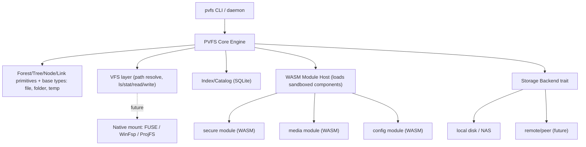

# PVFS — Architecture Decision Record (00)

Status: **Accepted** (foundational ADR; engine 1.x implements the core direction — see [doc 08](08-roadmap-and-status.md))
Date: 2026-06-06
Scope: Foundational decisions and module boundaries for a from-scratch PVFS. Intentionally lean — locks direction. WASM modules, FUSE mounts, and federation wire protocols remain future work as noted in the body.

---

## 1. Context, Vision, Non-Goals

### Vision

PVFS (PhraseVault File System) becomes a **standalone, cross-platform command-line service** that runs natively on Windows, Linux, and macOS — not a Docker-deployed web service.

The core idea: a **real filesystem abstraction layer** in which **node types** (analogous to file types) and the **modules** that back them allow data stored on *any accessible storage system* to be indexed, searched, served to an app, managed, and operated on with all normal filesystem functions.

- The whole structure is a **forest**, which may contain one or more **trees**.
- A **root node** is the first/base node of a tree.
- **Base node types (the only types built into the core):**
  - **file** — a single file, mirroring what the underlying filesystem has.
  - **folder** — a container of other nodes, mirroring a filesystem directory.
  - **temp** — a temporary node that is never kept as an orphan. The moment a temp item is orphaned (no active inbound links — the same orphan definition as any other node), it is purged automatically instead of being retained for review. Because it behaves fundamentally differently from a normal node, it is part of the core and can also be composed into any module's node type as a sub-type (e.g. a transient cache entry). **Temp data is local-only: it is never replicated between PVFS instances** (see [01-core-engine-design.md](01-core-engine-design.md) §2).
- **Extension modules** add everything else on top of these base types — searching, cross-referencing, rules, encryption, media handling, configuration, and so on. They are loaded as sandboxed plug-ins, not built into the core. Examples:
  - **secure** — generic encryption of individual files / file structures.
  - **media** — indexing and cross-referencing of media files.
  - **config** — configuration stored in a tree-like structure.

PVFS is designed from scratch as a self-contained system. The foundational concepts and principles it is built on are described in §2.

### Goals

1. Single self-contained binary; no container or language runtime required to run it.
2. A generic FS engine where node-type behavior lives in pluggable modules, not in the core.
3. Index / search / serve / manage any reachable storage backend through one abstraction.
4. A clean CLI + local daemon surface, scriptable and embeddable.

### Non-Goals (this round)

- No implementation, repo scaffolding, or full per-module specs.
- No commitment to a network/P2P protocol design (deferred to a later spec).
- No native mount implementation (FUSE/WinFsp) — only acknowledged as a future stage.

---

## 2. Foundational Concepts and Principles

This section explains the ideas PVFS is built on. Each idea is described in plain language first, then given its proper technical name and a short definition. You do not need a programming background to follow it.

### The mental model

Think of PVFS as a smart catalog that sits on top of wherever your files already live. Instead of caring about folders and paths, it organizes everything as a network of small, connected records. You can ask it questions ("show me everything tagged as a movie", "give me this file's contents"), and it figures out where the actual data is and how to hand it to you.

The building blocks:

- **Node** — the basic unit of information. A node describes one thing: a file, a setting, a piece of media, a folder. It is small and self-contained.
- **Link** — a labeled connection from one node to another. Links are how nodes relate ("this file belongs to this folder", "this movie is also in the Sci-Fi list").
- **Tree** — a group of nodes connected by links that all trace back to a single starting point. A tree represents one way of organizing things (for example, a folder hierarchy, or a list of everything tagged a certain way).
- **Root node** — the single starting point of a tree. Every tree has exactly one. (*Technical definition: the base node from which all of a tree's links descend.*)
- **Forest** — the whole collection. A forest holds one or more trees and is the top-level container for everything PVFS manages.

### The principles that keep it trustworthy

These are the rules that make the catalog reliable, verifiable, and safe.

- **Every record has a fingerprint.** A node's identity is calculated directly from its own contents. If even one character of the content changes, the fingerprint changes — so a node can never be quietly altered. *(Technical term: **content addressing**. The node's identifier is a **BLAKE3** cryptographic hash of its contents. BLAKE3 is a fast, modern hashing algorithm.)*

- **Records are permanent; only their connections can change.** Once a node is created it is never edited or rewritten. The flexible part of the system is the links between nodes, which can be added, retired, or replaced over time. *(Technical terms: an **immutable** (unchangeable) node layer, with a separate **mutable** (changeable) link layer.)*

- **Everything is signed by its author.** Each node and link carries a cryptographic signature proving who created it. Anyone can verify that signature independently, without trusting a central server. *(Technical term: **digital signatures** using **secp256k1**, the same elliptic-curve signature scheme used by Bitcoin and many other systems.)*

- **Nothing is truly deleted by accident.** Removing something just marks the connection as inactive; the underlying record stays intact and recoverable. A record with no remaining active connections is flagged as unused so it can be reviewed. Permanently erasing data is always a separate, deliberate action. *(Technical terms: **soft delete** (mark inactive rather than erase) and **orphan detection** (finding records nothing points to anymore).)*

- **A file's identity is separate from where it is stored.** PVFS records *what* a file is independently of *where* its bytes physically live. The actual data might sit on a local drive, a network share, or somewhere remote — and it can move or have several copies without changing the file's identity. *(Technical term: **storage-location abstraction**. A file record holds one or more **location** pointers, each a URI (Uniform Resource Identifier — a standard text address such as `file:///movies/x.mkv` or `https://host/path`) describing how to reach the bytes.)*

- **There is a fast local index for searching and browsing.** Alongside the records, PVFS keeps a lightweight on-disk database so it can answer questions quickly without scanning everything. This index can always be rebuilt from the records themselves. *(Technical term: an embedded **SQLite** database — a self-contained, file-based database that needs no separate server.)*

- **Content is checked before it is trusted.** When PVFS serves a file, it re-checks the bytes against the file's recorded fingerprint first. If they don't match, the content is flagged and held back rather than handed over. *(Technical term: **integrity verification** via hash comparison on read.)*

- **Large collections don't have to be processed all at once.** Fingerprinting huge libraries up front would be slow, so PVFS can register a file's existence immediately and compute its fingerprint later, on demand. *(Technical term: **lazy** or opt-in **hashing**.)*

---

## 3. Decision — Runtime / Language

### Decision: **Rust**

Rust is selected as the implementation language for the PVFS core and CLI.

### Rationale

1. **Single static binary, no runtime.** Directly satisfies "runs on any platform, not Docker." Cross-compilation to Windows/Linux/macOS (incl. Apple Silicon) is well supported.
2. **Native filesystem mount path.** A *real* FS abstraction layer benefits enormously from being able to expose a real mount later: `fuser` (FUSE on Linux/macOS via macFUSE) and WinFsp/ProjFS bindings on Windows. Rust has the strongest, most maintained ecosystem here.
3. **The cryptographic building blocks already exist as trusted, ready-made libraries.** PVFS depends on several standard cryptographic tools: one to create the content fingerprints (BLAKE3), one to sign records and verify who created them (secp256k1), one to encrypt private data (AES-256-GCM), and the wallet-standard pair that turns a generated recovery phrase into a whole family of keys (BIP39 + BIP32) — plus the embedded SQLite database. Rust ships well-tested, widely-used packages (called **crates** — Rust's term for a reusable library) for every one of these (`blake3`, `k256`, `aes-gcm`, `bip39`, `bip32`, `rusqlite`). This matters because hand-writing cryptography is risky and error-prone; building on audited, proven code is far safer. This item is listed as a rationale because it removes a major source of risk and effort from the project.
4. **True plug-ins from day one.** Modules are loaded as **WebAssembly (WASM)** components from the very first version — they are *not* compiled into the core binary. WebAssembly is a portable, sandboxed format: a small program that runs inside a safe, isolated environment (it cannot touch the rest of the system unless explicitly allowed) and can be written in many languages. The **component model** is an emerging WebAssembly standard that defines how such a sandboxed module describes the functions it offers and how the host calls them — so third parties can add new node types without recompiling or endangering the core. Rust has a mature, well-supported WASM host (`wasmtime`) that implements this. Building the module boundary this way from the start (rather than retrofitting it later) is a deliberate choice in line with the project directive: correct, solid architecture over speed to production.
5. **Predictable performance for a long-running file service.** Rust manages memory *without a garbage collector*. A **garbage collector (GC)** is a background process used by languages like Go, Java, or JavaScript that periodically reclaims memory the program is no longer using; to do so it briefly **pauses** the program (a "GC pause"). Those pauses cause short, unpredictable stalls — undesirable when streaming a file, serving a byte range, or running a daemon for days at a time. Rust frees memory automatically as values go out of scope instead, so there are no such pauses.

### Alternative: Go (documented, not chosen)

- **Pros:** simplest cross-compile, excellent daemon/CLI ergonomics, faster initial dev velocity, decent stdlib crypto.
- **Cons:** weaker native-mount story; plugin story is subprocess-RPC (`hashicorp/go-plugin`) or `-buildmode=plugin` (poor cross-platform support); cgo SQLite vs pure-Go tradeoffs.
- **When to switch to Go:** if dev speed and team familiarity outweigh the native-mount ceiling, Go is a reasonable fallback. The architecture in §5 is language-neutral enough to retarget.

### Rejected

- **Node/TypeScript** — the "no runtime, runs anywhere" goal is the explicit driver of this refactor; single-executable bundling (`pkg`/SEA) is fragile, native addons (better-sqlite3) complicate distribution. Reuse is explicitly not a priority.
- **Python** — already dropped; packaging a native single binary is even weaker than Node.

---

## 4. Decision — Generic Core + WASM Extension Modules

### Decision

PVFS is a **generic filesystem engine**. The core knows only about generic primitives (forest, tree, node, link, storage backend, index) plus a tiny set of **base node types** that mirror a real filesystem. Everything else — `secure`, `media`, `config`, search, cross-referencing, rules — is provided by **WASM extension modules** loaded by the core.

### Base node types (hard-coded in the core)

Only three node types are built in, and only because they are universal and fundamental:

- **file** and **folder** — they directly mirror what the underlying filesystem exposes, so the core can represent any real storage tree without a module.
- **temp** — an ephemeral node with a fundamentally different lifecycle (immediate purge instead of orphan retention, see §6). It is core both because it is broadly useful and because modules can reuse it as a sub-type of their own node types.

No other node type is hard-coded.

### Implications

- The core has **no** knowledge of media, encryption policy, config semantics, or any other domain concept.
- A module-defined node `type` is a string namespace owned by that module (e.g. `media.movie`, `secure.vault`, `config.value`). The owning module defines validation, indexing, search, and serve behavior for it.
- Modules can define their own link semantics on top of the generic link layer.
- All extension modules are **WASM from the start** — there is no compiled-in module path. This keeps the core small, the boundary honest, and the system extensible by third parties without recompiling.

---

## 5. Core Architecture & Module Boundaries



(`TD` in the diagram above is the Mermaid directive for a top-down layout.)

### 5.1 Core primitives

- **Forest** — the top-level container; holds one or more trees and owns the index + storage registry.
- **Tree** — a strict hierarchy with a single named **root node**. **Decided: every node has exactly one home** — at most one active `contains` parent (the root link counts as the root's home). Other trees and collections include a node via **`ref` cross-links**, never by a second `contains` parent. Example: the primary tree's `contains` structure mirrors where *The Fifth Element*'s file really lives; a "Movies" tree and a "Sci-Fi" tree each add a `ref` link to that same node. The `contains` hierarchy is therefore always a true tree; only the overall graph including `ref` links is a DAG.
- **Node** — content-addressed identity: `id = BLAKE3(canonical(type, label, visibility, payload, is_temp, creation_nonce, created_at, author))`. Immutable. Carries a signature over its id.
- **Link** — a typed, signed, directed edge. Content-addressed id, but a *mutable* state band (`removed_at`, `superseded_by`, `suspended_at`) lives outside the id preimage. Soft-delete only.

### How a tree is structured and walked

A tree is **not** a root node that points directly at every other node. That would force the root to know about everything and make ordering impossible. Instead the structure is built from links node-to-node, so it can be **walked** one step at a time:

- **Parent → child links** form the hierarchy. The root links only to its immediate children; each child links to its own children, and so on down the tree.
- **Sibling order** comes from a sortable **order key carried on each child link** (decided in the core design, [01-core-engine-design.md](01-core-engine-design.md) §3.4 — *not* previous/next pointer links), so one parent's children can always be listed in a defined sequence.

The result is that every node is only lightly connected — it knows its home parent and its children, not the entire tree — yet a complete, ordered traversal is always possible from any starting point. Taking part in this ordered, walkable structure is a **core capability of every node**, provided by the link layer (it is not re-implemented per module).

*(Technical terms: a **DAG (Directed Acyclic Graph)** is a set of one-directional links containing no cycles — "acyclic" means you can never follow links in a loop back to where you started. **Walking the tree** means traversing it link by link from the root rather than holding one giant list.)*

Trait sketch (illustrative, not final):

```rust
trait Node {
    fn id(&self) -> &NodeId;          // BLAKE3 content hash
    fn type_id(&self) -> &str;        // module-owned namespace, e.g. "media.movie"
    fn payload(&self) -> &Payload;    // plaintext or module-encrypted bytes
    fn author(&self) -> &PubKey;
    fn sig(&self) -> &Signature;
}
```

### 5.2 Node-Type Module contract (the plug-in boundary)

The most important boundary in the system. Modules are **WASM (WebAssembly) components from the start** — sandboxed and loaded at runtime, never compiled into the core (see §3). The interface below is the *conceptual* contract every module implements; the concrete version is expressed as a WASM component-model interface (a WIT definition), and the host calls into the sandbox across that boundary. The Rust trait shown here is just a readable illustration of the same shape, not a compiled-in plug-in path.

```rust
trait NodeTypeModule {
    /// Namespaces this module owns, e.g. ["secure.vault", "secure.file"].
    fn type_ids(&self) -> &[&str];

    /// Validate a node payload before it is written.
    fn validate(&self, node: &Node) -> Result<()>;

    /// Emit index entries (search keys, metadata) for the catalog.
    fn index(&self, node: &Node, ctx: &IndexCtx) -> Result<Vec<IndexEntry>>;

    /// Answer a query scoped to this module's node types.
    fn search(&self, query: &Query, ctx: &SearchCtx) -> Result<Vec<NodeId>>;

    /// Open/serve the node's content as a byte stream (e.g. decrypt for `secure`).
    fn open(&self, node: &Node, ctx: &OpenCtx) -> Result<ByteStream>;

    /// Optional lifecycle/management hooks (create, on_delete, on_orphan, ...).
    fn manage(&self, op: ManageOp, ctx: &ManageCtx) -> Result<ManageOutcome>;
}
```

Module responsibilities by example:
- **config** — validates key/value/section payloads; serves as a tree-structured settings store.
- **secure** — owns encryption of individual files and file structures; `open()` performs decryption; key handling is the module's concern, not the core's.
- **media** — indexes/cross-references media; defines `media.*` node types and cross-link semantics; metadata enrichment is module-internal.

### 5.3 Storage Backend trait

Abstraction over *where bytes live*. Local first; remote/peer/torrent/ipfs are future implementations of the same trait.

```rust
trait StorageBackend {
    fn scheme(&self) -> &str;                       // "file", "pvfs", "http", ...
    fn stat(&self, uri: &Uri) -> Result<StatInfo>;
    fn read_range(&self, uri: &Uri, range: ByteRange) -> Result<ByteStream>;
    fn write(&self, uri: &Uri, data: ByteStream) -> Result<StatInfo>;
    fn list(&self, uri: &Uri) -> Result<Vec<Entry>>;
    fn hash(&self, uri: &Uri) -> Result<Blake3Hash>; // for verification / dedup
}
```

A node references one or more locations (URIs). The VFS resolves the fastest/available backend; the node's content hash is the canonical identity, locations come and go (carried over from today's `pvfs.location` model).

### 5.4 VFS layer

- Maps **trees → directories** and **nodes → files** to power familiar operations: `ls`, `stat`, `cat`/read, `scan`, `add`.
- Path resolution walks tree links from a named root.
- **Native mount** (FUSE on Linux/macOS, WinFsp/ProjFS on Windows) is a documented **future** stage built on this layer — not part of v1.

### 5.5 Index / Catalog

- Embedded **SQLite (WAL)** as the local query index, rebuildable from the authoritative node/link log.
- Stores generic node/link rows plus module-emitted `IndexEntry` rows for search.
- Search is dispatched to modules (`search()`) and/or served from the catalog directly for generic queries.

### 5.6 CLI + daemon surface (sketch)

```
pvfs init                 # create a forest in the current data dir
pvfs serve                # run the local daemon (foreground/background)
pvfs scan <path>          # index a storage location into a tree
pvfs ls <tree|path>       # list nodes as directory entries
pvfs cat <node>           # stream a node's content (module open())
pvfs add <path> [--tree]  # register/import a file as a node
pvfs tree create <name>   # create a new tree (root node)
pvfs mount <mountpoint>   # FUTURE — native mount
pvfs <module> ...         # per-module subcommands, e.g. `pvfs secure ...`
```

HTTP/network access is an optional adapter that calls the same core API the CLI uses — never the primary interface.

---

## 6. Cross-Cutting Technical Details

This restates the principles from §2 with engineering precision and adds the cryptographic specifics.

- **Content addressing (BLAKE3).** A node's id is a BLAKE3 hash over a canonical preimage of `(type, label, visibility, payload, is_temp, creation_nonce, created_at, author)`. Identity is immutable; changing any field yields a new node.
- **Signing (secp256k1).** Nodes and links are signed by their author. Verification is independent of any server.
- **Immutable nodes, mutable link state.** The node log is append-only. Links carry an out-of-preimage state band for soft-delete / supersede / suspend.
- **Soft-delete + orphan model.** Links are never physically removed by default; a node is *orphaned* when it has no active inbound links. Hard delete (prune/purge) is an explicit, separate, opt-in operation. **Exception — `temp` nodes:** when a `temp` node is orphaned (same definition — no active inbound links), it is purged immediately instead of being retained for review. One orphan rule for all nodes; only the *consequence* differs (retain vs. purge).
- **Read-path integrity verification.** Bytes are hashed and checked against the node's content hash before serving; mismatches are recorded and the content is blocked from serving until resolved.
- **Crypto primitives.** BLAKE3 (addressing/hashing), secp256k1 (signing), AES-256-GCM (the `secure` module's payload encryption), BIP39 + BIP32 (generated seed phrase → hierarchical key derivation: identity root, per-device signing keys, reserved encryption branch — see [01-core-engine-design.md](01-core-engine-design.md) §7). All algorithms public; security from the generated seed.

### Identity and security posture

- Each PVFS instance has its own **local identity**: a keypair persisted in the data dir (owner-readable only), used to sign the nodes and links it creates.
- The **secure** module owns encryption-at-rest semantics; the core stores opaque bytes and never needs the key.
- Daemon access control (who may talk to `pvfs serve`) is an **open question** (§8) — default to local-socket / loopback-only for v1.

---

## 7. Phased Roadmap

| Phase | Deliverable |
|---|---|
| **P0 — Core engine (kernel)** | `pvfs` binary skeleton; data-dir init; forest/tree/node/link primitives; content addressing (BLAKE3) + signing/verify (secp256k1); base node types **file / folder / temp**; SQLite catalog; ordered tree walk (sibling order); soft-delete + orphan model + immediate temp purge; local identity keypair. **This is the first thing we build (see §9).** |
| **P1 — Storage backends + core FS ops** | `StorageBackend` trait + local/NAS backend; `init`, `tree create`, `scan`, `add`, `ls`, `stat`, `cat`; content-hash verification on the read path; **bound folders with auto-indexing** (live watcher + reconciliation scan; soft-remove on disk deletion); managed-temp spool + startup cleanup sweep. See [01-core-engine-design.md](01-core-engine-design.md) §6.3 / §8.5. |
| **P2 — WASM module host + module contract** | WASM component host (`wasmtime`); the module interface as a component-model (WIT) definition; host functions exposed to modules; load/validate/run sandboxed modules; **config** shipped as the first WASM module. |
| **P3 — More modules + index/search/serve** | **secure** and **media** modules (WASM); module-driven indexing + search dispatch; serve/stream path; optional HTTP adapter. |
| **P4 — Mount + remote backends + federation** | Native mount (FUSE/WinFsp/ProjFS); forest log replica sync; remote append to owner forests; PVFS catalog URI resolution. Protocol details in sync layer (`1.0.#`). Model: [03-federation-trust-and-uris.md](03-federation-trust-and-uris.md). |

Each phase will get its own detailed engineering spec once this ADR is approved. Because modules are WASM from the start, the module host (P2) lands before any domain behavior — no compiled-in module path is ever built.

---

## 8. Open Questions

1. **Native mount priority.** Which OS mount target ships first (FUSE on Linux vs macFUSE vs WinFsp)? Each has distinct packaging/permission constraints.
2. **Identity model.** *Resolved:* generated BIP39 seed phrase → BIP32 HD keys (identity root + per-device keys + encryption branch), device certificates in the log. See [01-core-engine-design.md](01-core-engine-design.md) §7.
3. **Search engine.** SQLite FTS5 vs an embedded index (e.g. Tantivy) for module-driven search at scale. FTS5 is simplest; Tantivy scales better for large media libraries.
4. **Daemon access control.** Loopback-only socket vs token-authenticated local API vs OS keyring integration for `pvfs serve`.
5. **Canonical log vs SQLite.** *Resolved:* append-only event log + SQLite projection; temp exception. See [01-core-engine-design.md](01-core-engine-design.md) §2.
6. **Federation & sync.** *Resolved (model):* forest ownership, log sync as immutable copy, URI grammar, trust fixes. Wire protocols deferred to sync layer P4 / `1.0.#`. See [03-federation-trust-and-uris.md](03-federation-trust-and-uris.md). **Still open:** instance discovery, failover writer, remote-append auth — see that doc §6.

---

## 9. First Build Target

The first thing to actually build is the **core engine (kernel)** — phase P0. Everything else depends on it: the storage backends operate on its nodes, and the WASM module host can only be meaningful once nodes, links, signing, and the catalog exist.

The core engine is the right starting point because it has **no upward dependencies**, it is fully testable in isolation, and it pins down the data model and trust guarantees that the rest of the system is built on. It contains the base node types (`file`, `folder`, `temp`), content addressing, signing, the tree/sibling-order walk, the orphan/temp lifecycle, and the SQLite catalog.

Its detailed design is being developed separately in [01-core-engine-design.md](01-core-engine-design.md). No implementation begins until that design is agreed.
