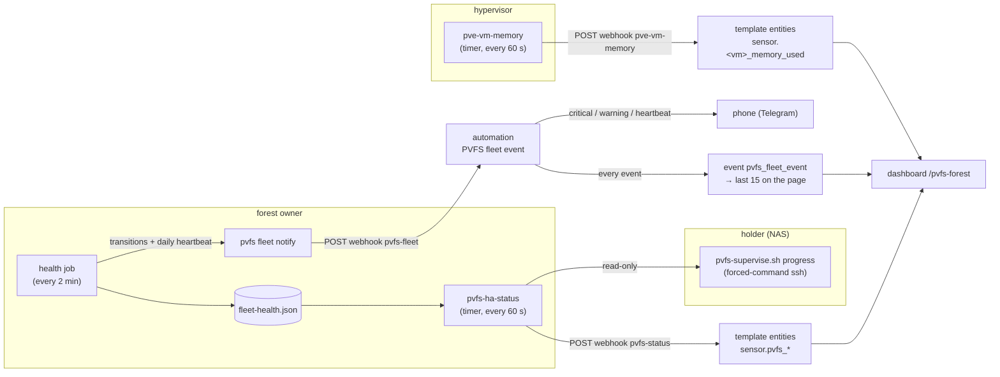

# 30 — Monitoring the fleet: what PVFS tells you, and a worked Home Assistant build

**Status: current (2026-09-13).** Pulls together what grew across PVOS
milestones D83, D131, D135, D136, D142, D143 and D146. The PVFS side (§1) is
product; the Home Assistant side (§2) is one deployment of it, described as a
worked example you can copy or translate to another system.

Addresses below are placeholders: `<owner>` is the forest owner's host,
`<holder>` a NAS-style holder, `<ha>` the Home Assistant host.

---

## 0. The rule that shaped all of it

**A monitor that cries wolf is worse than none.** Every piece below exists
because an earlier version reported something that was not true — a working
job called `stalled`, a caught-up follower called `overdue` for days, a
phone message that was a pin and a return code, a VM at "98% memory" with 3.5
GB free. Each section says what the number means *and what it does not*.

The second rule (Chris, D136): **silence means down.** A daemon that is alive
and working must answer its health probe; "it is probably just busy" is a
defect to fix, never a state to reason around.

---

## 1. What PVFS exposes

Four layers, each built on the one before.

### 1.1 One box: `pvfs serve status`

Every `pvfsd` answers `pvfs serve status [--json]` (member-gated): one row per
serve job with `state`, `last_ok_ms` (the last success) and `last_error`. **A
job's error is cleared by its next success**, so a present error means its
last run failed.

| state | means | does NOT mean |
|---|---|---|
| `running` | the job is working (a pass in flight, or a continuous job connected) | that it is making progress — see `stalled` |
| `idle` | between passes; the last pass finished | — |
| `backoff` | a transient failure; the job retries by itself (`last_error` says why) | that anyone must act yet |
| `error` | the job's thread exited; the supervisor restarts it later | — |
| `disabled` | not configured on this box | — |
| `stalled` | a pass has been in flight far past **this job's own measured** typical duration (D81/D85) — evidence of being stuck | — |
| `overdue` | no pass has completed for 3 × the job's interval (floored per job: tier/receive 6 h, watch 36 h) | that it is stuck: a long pass over a large library is normal (D100) |

**`follow` is special, and honest since D146.** It is a continuous tail
(long-poll the source's log, 5 s window; fold what arrives). It stamps its row
on every reply that proves it current — events folded, or an empty reply whose
returned source tip is not ahead of its own. So on `follow`, `last_ok` means
*last confirmed current with the source* (seconds old when healthy), and
`overdue` means it has not been able to say that for 15 minutes — believe it.
Before D146 only landed events counted; on a quiet log every replica read
`overdue` indefinitely while its log tip matched the owner's.

To prove "caught up" without trusting any status: compare
`select max(seq) from events` in the owner's and the replica's `log.db`,
opened read-only.

### 1.2 The owner's view: the `health` job and `pvfs fleet health` (D131, D136)

On the owner, `pvfs serve enable health` polls every announced peer every
2 minutes — `info` + `serve status` over the existing member-gated dial — and
keeps the record in `<data>/fleet-health.json`:

```text
polled_at_ms
peers: { <transport pin>: {
    addr, version,                     # version from the catalog's .fleet/versions
    last_attempt_ms, last_ok_ms,
    unreachable_since_ms, misses,      # DOWN after 2 consecutive misses
    last: { reachable, forest_ok, runner, jobs: [{name, state, last_ok_ms, last_error}],
            conflicts, stale, capacity: [free, total], error },
    actions: [...], attempts } }       # what supervision did (D135)
```

`pvfs fleet health` prints it (`--now` polls first; `--json` for scripts).
Two misses before "down" is the hysteresis: a daemon restarting — a minute,
with its drain — is not an outage. The probe never waits on a writer lock or
anything slow (D136), so a busy daemon still answers.

### 1.3 Acting: `pvfs fleet supervise` (D135)

A holder without a service manager (a NAS appliance) is supervised by the
owner over **one ssh key bound to one script** by a forced command in the
holder's `authorized_keys` — the owner can run exactly these verbs and never
a shell:

| verb | does |
|---|---|
| `status` | `serving`, `busy <pid> <cpu-delta>` (CPU sampled twice, 10 s apart), `wedged <pid>`, or `down` |
| `start` | start the daemon if no process exists — **the only automatic verb** |
| `restart` | refuses `serving`/`busy`; kills a wedged one, then starts |
| `version` | what the binaries report |
| `install` | a tar of binaries on stdin, verified, swapped (keeps `prev/`) |
| `progress` | read-only: the receiver's non-empty `.partial` files and the dry-run receive plan (PVOS D143) |

`pvfs fleet supervise <pin> --ssh user@<holder> --key ~/.ssh/pvfs-supervise`
registers the channel; the health job sends `start` after two missed polls,
backed off from 10 minutes doubling to 2 hours, recorded under `actions`.

### 1.4 Telling a person: `pvfs fleet notify` (D142)

```bash
pvfs fleet notify http://<ha>:8123/api/webhook/pvfs-fleet --format ha \
    --label '<holder-ip>=the NAS' --label '<ingest-ip>=feederbox'
pvfs fleet notify --test        # one test event
pvfs fleet notify --off
pvfs fleet notify               # bare: show (or prompt for) the setting
```

Formats: `ha` (JSON for a Home Assistant webhook), `slack`, `discord`,
`ntfy`, `json`. The owner's health job POSTs **on transitions only**, one
`curl` with a 10 s timeout, a failure logged and never failing the pass:

| event | when | severity |
|---|---|---|
| `peer_down` | a peer missed two polls (once, with since-when) | critical |
| `supervise` | a `start` was sent — ok, or failed | info / critical |
| `peer_up` | a peer answers again (with how long it was down) | info |
| `job_error` | a job's error has persisted **two** polls (once, until it changes); the stall detector's `overdue` notice is filtered | warning |
| `heartbeat` | every 24 h: "All good: N boxes up, nothing to do." or what is down | info / warning |
| `test` | `--test` | info |

Payload (format `ha`/`json`):

```json
{"event": "peer_down", "severity": "critical",
 "summary": "the NAS is down. It has not answered for 4 minutes. …",
 "name": "the NAS", "at_ms": 0, "peer": "93fc7ff2", "addr": "<holder-ip>:7433",
 "since_ms": 0, "detail": "…", "up": 2, "down": 1}
```

`summary` is one plain sentence naming the box — the only thing a person
should have to read. The first version sent the raw fields
(`supervise ddf9bc62 <ip>:7453 start → rc 0: started 25011`), which Chris
rightly called meaningless; the sentence is the product.

The daily heartbeat exists so a *silent owner* is noticed by its absence —
the one failure the fleet cannot report about itself (§2.1).

---

## 2. Worked example: the Home Assistant build

Three feeds, one pattern: **the thing being watched pushes JSON to a
local-only webhook; Home Assistant turns it into entities, notifications and a
page.** No HA token lives on a fleet box, nothing new is exposed inbound, and
HA stays the one place a person looks.



### 2.1 Notifications (PVOS D142)

One automation on webhook `pvfs-fleet` (`local_only: true`, POST only):

1. **Relay** the event as an HA event `pvfs_fleet_event` (sentence, severity,
   time) — every event, sent or not, for the page's "Recent fleet events".
2. **Send** only what someone can act on: `critical`, `warning`, the daily
   heartbeat and the test — titled 🔴 / 🟠 / 🟢, the body the `summary`
   sentence and nothing else. A restart that worked and a box coming back are
   info: logged, not sent.

A second automation runs hourly and pages if the first has not triggered for
**26 hours**: the heartbeat is daily, so its absence means the owner itself is
down or cannot reach HA. "Last seen" is the automation's own
`last_triggered` — no helper to keep in sync.

Lessons baked in:
- **Actionable only, or the channel gets muted.** The first round sent the
  stall detector's `overdue` and "restart worked"; both were removed within
  the day.
- **A webhook id has exactly one listener** in HA, which is why the page's
  event list is fed by an HA event the automation fires, not by a second
  listener on the webhook.
- **Test by firing the HA event directly**, never by posting to the webhook:
  that pages the phone and resets the silent-owner clock.

### 2.2 The status page (PVOS D143)

**The collector** — `pvfs-ha-status` (Python, stdlib only) on the owner, run by
a systemd timer every minute, **read-only everywhere**:

| reads | for |
|---|---|
| `fleet-health.json` | each peer: up/down, build, jobs with last run, free space |
| `pvfs serve status --json` | the owner's own jobs |
| `pvfs region ls --json` | each catalogue region's head and entries |
| `pvfs region entries <id> --json` (only when a head moves) | the file lists diffed into "moved / deleted" |
| the holder's `progress` verb (§1.3, the supervise key) | the mover: partial sizes + the receive plan |
| `pvfs view ls <dir> --json` (cached by hash) | sizes of queued files |

It POSTs one JSON snapshot to webhook `pvfs-status`:

```text
v, at, forest, forest_id
state: ok | warning | critical        summary        problems[]        conflicts
boxes.<label>: { label, addr, up, since, version, free_gb, total_gb,
                 jobs: [{job, state, last_ok, error}] }
mover: { state: moving | waiting | stalled | idle | unknown,
         in_flight, active: [{title, file, size_gb, moved_gb, pct, replaces}],
         pct, moved_gb, size_gb, rate_mbs, left_files, left_gb, eta_h,
         queue: [{title, gb, current, replaces}], failed, no_space }
catalogue.<region>: { entries, head, stale, fetched }
activity: { recent: [{at, kind, title, gb, region, from?}], last,
            moved_24h, added_24h, deleted_24h, cleared_24h, arrived_24h }
```

**The HA side** is trigger-based template entities on that webhook (a UI
template helper cannot take a webhook trigger, hence YAML): `sensor.pvfs_forest`
(ok/warning/critical + summary), a connectivity binary sensor per box with its
jobs as an attribute, `sensor.pvfs_mover*` (state, progress, moved, rate,
files/GB/hours left), catalogue entries per region, `sensor.pvfs_recent_activity`,
`sensor.pvfs_last_fleet_event`, and a non-trigger `binary_sensor.pvfs_status_feed_stale`
that turns on after 5 minutes without a snapshot — the entities cannot say
"no snapshot has come" themselves.

**The page** (`/pvfs-forest`, a sections view): the forest headline and
problems; the boxes (daemon answering, build, free space); **jobs — last run**
(✅ how long ago it last succeeded, ❌ the error, ⏳ the stall detector's
notice); the mover (each file in flight with its %, the aggregate rate, the
queue, what is left and when); **recently moved & deleted**; the catalogue;
the machines; and the recent fleet events.

**Design rules the build taught:**
- **Progress is only as honest as its source.** The holder writes each
  `.partial` in order (D144, even with several ranges in flight), so a
  partial's size *is* that file's progress. With several files at once, the
  rate is the **sum** of their growth — taking "the newest partial" as the
  current file under-read the rate and over-read the ETA.
- **Moved and deleted come from diffing catalogues**, not logs: a path new to
  a library that staging held was moved (or an upgrade, if other bytes were
  there); the same bytes at a new path were renamed; a path gone from a
  library was deleted. Media only (a video extension or ≥ 100 MB); hundreds
  at once is one "bulk" line; a region's first sight is its baseline.
- **A gauge cannot show "unknown"**: idle reads 0.
- **Keep the recorder quiet**: the per-minute numbers are small sensors of
  their own; the attribute blobs (the queue, the box table, the events)
  change only when something changes. The summary sentence deliberately
  omits progress so the forest sensor does not churn.
- **Say what is observed.** The page shows `overdue` as a state with the job's
  last success, not as a failure; after D146 an overdue `follow` is real.

### 2.3 A sidebar on honest numbers: hypervisor memory

The same pattern fixed a number that was lying in HA for every VM. Proxmox VE
computes a VM's memory as `total − free` from the balloon driver, and a Linux
guest's *free* excludes its page cache — so a healthy VM that has read a few
GB of files reads 90–100% (pvfs-owner: "98%" with 3.5 GB available). The same
balloon device reports the guest's **available** memory (QEMU's
`stat-available-memory`); PVE just does not use it. A read-only script on the
hypervisor (`qom-get /machine/peripheral/balloon0 guest-stats` through PVE's
own QMP client) posts every VM's `total − available` to a webhook each minute
— `sensor.<vm>_memory_used`. Documented in the HomeLab repo
(`docs/VM_MEMORY.md`). The lesson is the same as §1.1's: find the number that
means what the label says.

---

## 3. Adapting it

- **Minimum viable monitoring**: `pvfs serve enable health` on the owner,
  `pvfs fleet notify <url>` with whatever format your phone already speaks
  (`ntfy` needs no account), and *something* that alarms when the daily
  heartbeat stops arriving. That covers a box going down, a restart that
  failed, a job failing twice, and the owner itself going silent.
- **Another notifier**: `--format slack|discord|ntfy` shape the same events
  for those services; `json` is the raw payload for anything else.
- **Another dashboard**: the collector's snapshot is plain JSON; point it at
  any webhook-to-metrics bridge. PVFS has no Prometheus endpoint today — the
  pieces an exporter would need are `serve status` and `fleet-health.json`.
- **A holder with a service manager** (systemd) does not need `fleet
  supervise`; the service manager restarts it, and the health job still
  reports what it sees.

## 4. Where the example lives

| piece | where |
|---|---|
| the HA automations (notifications, silent owner) | PVOS `deploy/homeassistant/pvfs-fleet.yaml` |
| the template entities | PVOS `deploy/homeassistant/pvfs-status.yaml` |
| the dashboard | PVOS `deploy/homeassistant/pvfs-dashboard.json` |
| the collector + its timer (`--tags ha-status`) | PVOS `deploy/ansible/fleet/pvfs-ha-status.py`, `fleet.yml` |
| the supervise script (incl. `progress`) | PVOS `deploy/ansible/fleet/pvfs-supervise.sh` |
| the milestones, with every deviation | PVOS `docs/milestones/D142`, `D143` (three follow-ups), `D146` |
| hypervisor memory | HomeLab `docs/VM_MEMORY.md`, `playbooks/pve_vm_memory.yml` |
