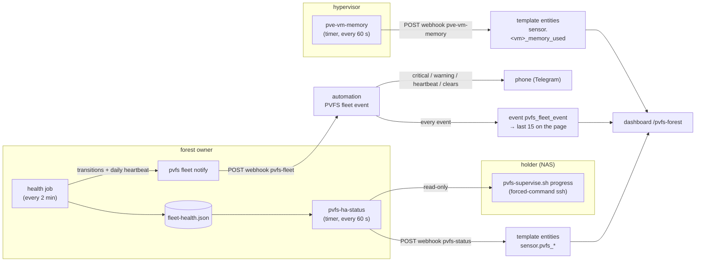

# 30 — Monitoring the fleet: what PVFS tells you, and a worked Home Assistant build

**Status: current (2026-10-04).** Pulls together what grew across PVOS
milestones D83, D131, D135, D136, D142, D143, D146, D148, D176, D177, D178,
D181, D182, D183, D196, D200, D206, D207 and D211. The PVFS side (§1) is
product; the Home Assistant side (§2) is one deployment of it, described as a
worked example you can copy or translate to another system. (PVOS D218,
2026-10-04, read §1 against the code; §2's Home Assistant side was not
checked against the running system.)

Addresses below are placeholders: `<owner>` is the forest owner's host,
`<holder>` a NAS-style holder, `<ha>` the Home Assistant host.

---

## 0. The rule that shaped all of it

**A monitor that cries wolf is worse than none.** Every piece below exists
because an earlier version reported something that was not true — a working
job called `stalled`, a caught-up follower called `overdue` for days, a
phone message that was a pin and a return code, a VM at "98% memory" with 3.5
GB free. Each section says what the number means *and what it does not*.

The second rule (Chris, D136): **silence means down.** A daemon that is alive
and working must answer its health probe; "it is probably just busy" is a
defect to fix, never a state to reason around.

---

## 1. What PVFS exposes

Four layers, each built on the one before.

### 1.1 One box: `pvfs serve status`

Every `pvfsd` answers `pvfs serve status [--json]` (member-gated): one row per
serve job with `state`, `last_ok_ms` (the last success) and `last_error`. **A
job's error is cleared by its next success**, so a present error means its
last run failed.

| state | means | does NOT mean |
|---|---|---|
| `running` | the job is working (a pass in flight, or a continuous job connected) | that it is making progress — see `stalled` |
| `idle` | between passes; the last pass finished | — |
| `backoff` | a transient failure; the job retries by itself (`last_error` says why) | that anyone must act yet |
| `error` | the job's thread exited; the supervisor restarts it later | — |
| `disabled` | not configured on this box | — |
| `stalled` | a job that reports progress (`watch`, `receive`; PVOS D207): its pass has not advanced for 30 minutes, and the error says where it stopped. Any other job: a pass has been in flight far past **this job's own measured** typical duration (D81/D85). Either is evidence of being stuck | — |
| `overdue` | no pass has completed for 3 × the job's interval (floored per job: tier/receive 6 h, watch 36 h). Never said of a pass that reports progress and is advancing (PVOS D207) | that it is stuck: a long pass over a large library is normal (D100) |

**A running pass's own account (PVOS D207).** While a `watch` or `receive`
pass is in flight, its row in `serve status` (and in the owner's health
record) carries `progress`: when the pass began and last moved, the files and
bytes done, its phase (`walking`, `hashing`, `writing`, `sweeping`,
`probing`, `publishing`, `pulling`) and the files in hand with their bytes and sizes.
`pvfs serve status` prints it under the job.

**`follow` is special, and honest since D146.** It is a continuous tail
(long-poll the source's log, 5 s window; fold what arrives). It stamps its row
on every reply that proves it current — events folded, or an empty reply whose
returned source tip is not ahead of its own. So on `follow`, `last_ok` means
*last confirmed current with the source* (seconds old when healthy), and
`overdue` means it has not been able to say that for 15 minutes — believe it.
Before D146 only landed events counted; on a quiet log every replica read
`overdue` indefinitely while its log tip matched the owner's. *Since PVOS
D196* a follower's overdue says so in its own words — *"no word from the
source in N min — its long-poll never came back: the follower is hung"* — and
it is the one `overdue` that reaches the phone and the page (below). A
follower that fails retries in backoff, 2 s doubling to 30 s, back to 2 s at
the next contact that proves it current.

**A failed pass reaches the log (PVOS D196).** Every job's failures are in
its row; the journal (on the NAS, `pvfsd.log`, each line dated by the start
script since PVOS D200) hears each run of them once:
`pvfsd: <job> pass failed: <error>; the next pass tries again` at the first
failure and whenever the text changes, then `pvfsd: <job> recovered: a pass
completed after N failed pass(es) over <span>`. The watch, the follower, a
thread's exit and the trash step have said so since D157/D159/D176; the
periodic jobs (catalogue, receive, resolve, health, reclaim, sync, export,
tier, evict) since D196.

To prove "caught up" without trusting any status: compare
`select max(seq) from events` in the owner's and the replica's `log.db`,
opened read-only.

**Beside the rows**, `serve status` carries seven facts about the box (and
the log's tip, the fence and the last log copy: §1.3b), each
defaulted so an older daemon's reply still decodes: `conflicts` (D127, paths
in conflict in the merged view), `stale` (D129, catalogue regions held at a
superseded head), `capacity` (D131, the free and total bytes of the data
dir's filesystem), **`stores`** (PVOS D178: every filesystem the box stores
on — the data dir's first, then each one under the roots of the catalogue
regions it catalogues from its own disk, once per device, with the regions
on it; a holder's files are rarely on the data dir's disk, so `capacity`
alone said mediabox had 339 GB free while both its stores were 98 % full),
**`build`** (PVOS D200: the build the daemon runs, e.g. `v1.4-495-gc17ae29`
— not the CLI's, which after a roll that did not restart the daemon is
another; absent from an older daemon), **`mounts`** (PVOS D181: the view
mounts running on the box, each with its `mountpoint`, the `build` the mount
process runs, `behind` — it is on an older build than the daemon and waits
for a minute with nothing open through it — `stale`, why it can no longer
read the catalogue when it says so, and `started_ms`; in `--json` and in the
owner's health record, not in the plain output) and **`trash`** (D148). `trash` has one entry per catalogue region the box holds:
the bytes in its `.pvfs-trash`, the number of day buckets, the oldest
bucket's day (days since the epoch), the region's retention, what the last
purge freed, and when it was measured (`measured_ms`).

Every daemon purges its own regions' trash by retention and measures it once
at start and then every five minutes, whatever jobs it runs (D176). Before
D176 only the `receive` and `resolve` passes did that, so a box running
neither (mediabox) never purged its trash and never reported it. The probe
never walks a disk (D136): the figure is the last step's.

| `trash` | means | does NOT mean |
|---|---|---|
| a region with `measured_ms` minutes old | the step ran; bytes and buckets are what the purge kept | that anything was purged (`freed_bytes` says; usually 0) |
| no entries | the box holds no catalogue region, or its daemon started less than a step ago | that the trash is empty: a daemon older than D176 reports only after a `receive`/`resolve` pass |
| a bucket older than its retention + 1 day | the purge is not running, or it is failing: the journal says `pvfsd: trash purge failed: …` once per run | — |
| `measured_ms` more than 30 minutes (six steps) old when the box answered | the step has stopped (a wedged daemon, a purge stuck on a disk, or it could not list the box's regions) or keeps failing for that region (`trash purge failed`); the page raises it (§2.2) | anything, on a daemon older than D176: it measures only at the end of a `receive`/`resolve` pass, and a `receive` pass can take hours |
| a region in the box's `stores` with no entry, for 30 minutes as the page sees it (PVOS D206) | that region's purge has failed every time since the daemon started (`trash purge failed` in the journal says why), so it was never measured; the page raises it (§2.2) | a slow step: the first runs within five minutes of the daemon's start |

### 1.2 The owner's view: the `health` job and `pvfs fleet health` (D131, D136)

On the owner, `pvfs serve enable health` polls every announced peer every
2 minutes — `info` + `serve status` over the existing member-gated dial — and
keeps the record in `<data>/fleet-health.json`:

```text
polled_at_ms
peers: { <transport pin>: {
    addr, version,                     # version from the catalog's .fleet/versions
    build,                             # PVOS D200: the last build its daemon said
    last_attempt_ms, last_ok_ms,
    unreachable_since_ms, misses,      # DOWN after 2 consecutive misses
    last: { reachable, forest_ok, runner, jobs: [{name, state, last_ok_ms, last_error}],
            build, conflicts, stale, capacity: [free, total],
            stores: [{path, regions, free_bytes, total_bytes}],   # D178
            mounts: [{mountpoint, build, behind, stale, started_ms}],   # D181
            trash: [{region, bytes, buckets, oldest_day, retention_days,
                     freed_bytes, measured_ms}], error },   # §1.1
    actions: [...], attempts } }       # what supervision did (D135)
```

`version` is what the box announced (`pvfs fleet announce`, D72): the crate
version, wire proto and schema, **not the build**. Two builds with the same
proto and schema read the same (v1.4-391 and v1.4-393 are both
`{"pvfs":"1.4.0","proto":11,"schema":19}`). *Since PVOS D200* the probe
records the build the peer's daemon says in `serve status`: `last.build` is
this probe's, and `build` beside `version` is the last one heard — kept while
the box is down, so its row still says what it ran. A daemon older than D200
says nothing, and its row has only `version`. `last` is the latest probe's
answer, successful or not, taken at `last_attempt_ms`; `last_ok_ms` is the
latest that succeeded.

`pvfs fleet health` prints it (`--now` polls first; `--json` for scripts).
Two misses before "down" is the hysteresis: a daemon restarting — a minute,
with its drain — is not an outage. The probe never waits on a writer lock or
anything slow (D136), so a busy daemon still answers.

### 1.3 Acting: `pvfs fleet supervise` (D135)

A holder without a service manager (a NAS appliance) is supervised by the
owner over **one ssh key bound to one script** by a forced command in the
holder's `authorized_keys` — the owner can run exactly these verbs and never
a shell:

| verb | does |
|---|---|
| `status` | `serving`, `busy <pid> <cpu-delta>` (CPU sampled twice, 10 s apart), `wedged <pid>`, or `down` |
| `start` | start the daemon if no process exists — **the only automatic verb** |
| `restart` | refuses `serving`/`busy`; kills a wedged one, then starts |
| `version` | what the binaries report |
| `install` | a tar of binaries on stdin, verified, swapped (keeps `prev/`) |
| `progress` | read-only: the receiver's non-empty `.partial` files and the receive plan (PVOS D143), with each file's size, from the running daemon — `pvfs serve receive-plan`, which never opens the forest (PVOS D174; it was `view receive --dry-run`, a fold of the production forest once a minute) |

`pvfs fleet supervise <pin> --ssh user@<holder> --key ~/.ssh/pvfs-supervise`
registers the channel; the health job sends `start` after two missed polls,
backed off from 10 minutes doubling to 2 hours, recorded under `actions`.

### 1.3b The log's tip, and the fence (PVOS D182)

`serve status` carries `log: {seq, hash}` — the box's top-log tip — and, on a
fenced owner, `fenced: {reason, peer, peer_seq, own_seq, at_ms}`; a box that
makes dated copies adds `backup: {at_ms, ok, seq, error}`. The owner's health
job judges every peer's tip against its own log and records the verdict per
peer (`log_verdict`: `consistent`; `ahead` — this owner is stale and fences
itself; `ahead-unproven` — a longer log claimed by a peer whose announcing
key has no admin on the forest root: marked, not believed, and the owner
does not fence; or `diverged`), with its own `fenced`, `self_addr` and
`self_log_seq`, in `fleet-health.json`. `pvfs forest tip [<mount>]` prints
one box's tip read-only (beside a running daemon); `pvfs forest fence` shows
and lifts a fence. *Since PVOS D196* a replica asks its owner's `serve status`
whenever it opens a route to write through it; a `fenced` answer is no route,
as an unreachable owner is, so a box whose bindings are all catalogue regions
catalogues here and publishes its head locally (pending, D183) instead of
failing every pass against the refusal. Its watch logs `no route through the
owner (… the owner is fenced (…)) — cataloguing here`, and the pending head
commits at the first pass after the fence is lifted or the box is re-pointed. Labels (`--label`) resolve by `host:port` before `host`,
so two daemons on one box can be named apart.

### 1.4 Telling a person: `pvfs fleet notify` (D142)

```bash
pvfs fleet notify http://<ha>:8123/api/webhook/pvfs-fleet --format ha \
    --label '<holder-ip>=the NAS' --label '<ingest-ip>=feederbox'
pvfs fleet notify --test        # one test event
pvfs fleet notify --off
pvfs fleet notify               # bare: show (or prompt for) the setting
```

Formats: `ha` (JSON for a Home Assistant webhook), `slack`, `discord`,
`ntfy`, `json`. The owner's health job POSTs **on transitions only**, one
`curl` with a 10 s timeout, a failure logged and never failing the pass:

| event | when | severity |
|---|---|---|
| `peer_down` | a peer missed two polls (once, with since-when) | critical |
| `supervise` | a `start` was sent — ok, or failed | info / critical |
| `peer_up` | a peer answers again (with how long it was down) | info |
| `job_error` | a job's error has been there, with the same text, for about **four minutes** — the third poll, timed from when it was first seen, so the owner's own restarts in a row never count (D151); once, until it changes, and a changed text waits its own four minutes; the stall detector's `overdue` notice is filtered — except on `follow`, where it is a hung follower (PVOS D196) | warning |
| `job_error_cleared` | a `job_error` that WAS sent has been gone for the same ~four minutes (D161): once per episode, naming the text last sent and how long it lasted (`since_ms` → `until_ms`); back inside the wait it is one episode and nothing is said; an error that cleared before it was sent is never cleared | info |
| `heartbeat` | every 24 h: "All good: N peers reporting, nothing to do." or what is down. N is the announced endpoints this box polls — never itself, so a four-box fleet reports three | info / warning |
| `test` | `--test` | info |
| `owner_fenced` | PVOS D182: this owner fenced itself — a peer holds more of the log than it does (restored from an older copy, or replaced by a promotion); it writes nothing until a person looks (`pvfs forest fence`). Once; on the first poll too. While fenced the owner says nothing else but the heartbeat, which then reads "still fenced" (warning) | critical |
| `owner_unfenced` | the fence was lifted (a clear, sent as ✅) | info |
| `peer_diverged` | a peer's copy of the log differs from the owner's at its tip: it followed a writer that is not the owner, or was restored wrongly; the owner takes no writes from it until it is re-seeded. Once | warning |
| `peer_diverged_cleared` | that peer agrees again (re-seeded) — a clear, sent as ✅ | info |
| `trash_stuck` | PVOS D231: a box's trash purge could not wholly remove a bucket past retention: the bucket, the first path that would not go, the error, and whose folder it is when not the daemon's user (the usual cause: a folder made by `sudo pvfs`). The rest of that trash is still purged. Also a region whose purge failed as a whole (its trash unreadable: `serve status` `purge_error`). Not a `job_error`: the trash step is no job, and its failure used to be a journal line only. At first sighting (the trash step plus the next poll), once per bucket or region, remembered across restarts and missed probes (`notify-state.json`); the owner's own trash too | warning |
| `trash_stuck_cleared` | that bucket's region was purged again and the bucket is gone, or the failing region's purge runs again — a clear, sent as ✅ | info |

Payload (format `ha`/`json`):

```json
{"event": "peer_down", "severity": "critical",
 "summary": "the NAS is down. It has not answered for 4 minutes. …",
 "name": "the NAS", "at_ms": 0, "peer": "93fc7ff2", "addr": "<holder-ip>:7433",
 "since_ms": 0, "detail": "…", "up": 2, "down": 1, "forest": "media"}
```

`forest` (PVOS D206) names the forest the event is about: the alias it is
registered under on the owner (`pvfs forest register --alias`), else its
mount directory's name; it is absent only when neither can be read. The
chat formats lead with it (`PVFS media: …`), and ntfy's title carries it
(`PVFS media peer_down`). `summary` is unchanged. Chris's fleet (PVOS
D211) routes by it in Home Assistant: an event with no `forest`, an empty
one or `media` is production and may reach the phone; any other (the lab
owner's `lab5m`) goes to the page's event list and HA's logbook only — a
test system never notifies a person.

`summary` is one plain sentence naming the box — the only thing a person
should have to read. The first version sent the raw fields
(`supervise ddf9bc62 <ip>:7453 start → rc 0: started 25011`), which Chris
rightly called meaningless; the sentence is the product.

The daily heartbeat exists so a *silent owner* is noticed by its absence —
the one failure the fleet cannot report about itself (§2.1). Since PVOS D182
the worked example below does not wait a day for it: Home Assistant pages
when the owner's status feed stops for ten minutes, or when the feed says the
owner's daemon is down (the notifier lives inside that daemon).

---

### 1.5 The log itself (PVOS D222)

Every line the daemons write — pvfsd, the `pvfs mount` view, the companion's
`serve` — is a record with a severity, a stable event name, a category
(`system`, `audit`, `security`) and named fields
([doc 32](32-log-events.md) lists the names). The text is the same as
before. Under systemd the journal gets the record's parts as fields
(`PRIORITY` and `PV_EVENT`, `PV_CATEGORY`, `PV_<FIELD>` …), so:

```bash
journalctl -u pvfsd-replica2 PV_EVENT=pvfs.job.failed
journalctl -u pvfsd-replica2 -p warning
journalctl -u pvfsd-replica2 -o json | jq 'select(.PV_EVENT != null) | {PV_EVENT, MESSAGE}'
```

The NAS's `pvfsd.log` is plain text, as before. `PVFS_LOG_FORMAT`
(`auto`/`text`/`journal`/`json`/`logfmt`), `PVFS_LOG_LEVEL` and
`PVFS_LOG_PRIVACY` in a unit change that. Shipping the records to a log
server, Splunk or a SIEM is [doc 33](33-shipping-logs.md) (PVOS D222d); our
own log server reads the journal fields with Alloy (HomeLab
`docs/LOGGING.md`).

### 1.6 Everything at once: `pvfs diagnose` (PVOS D230)

One troubleshooting bundle, to read or to hand to whoever helps:

```bash
pvfs diagnose                       # asks: the other boxes too? how far back? where to save it?
pvfs diagnose --this-box --since 30m --out -   # scripts: this box, to the terminal
```

For this box and (unless `--this-box`) every box it knows, which are the
owner's `fleet-health.json` peers or the forest's endpoint records, it
gives:

- build and proto;
- role, forest, jobs, regions and listener;
- up since when;
- the clock against this box's (flagged past 2 s);
- the log level and privacy;
- each log destination's health;
- stores and free space;
- jobs and their last errors;
- mounts;
- the log tip, fence and backup;
- every warning and error since the time asked, counted by event and
  `error_kind`, then listed (the newest 300 per box).

This box adds its kernel, uptime and load, and whether NTP has synced it.
A box that does not answer is a section saying why.

**Where the failures come from.** Each daemon keeps every record at
warning or above, as JSON, in `<data dir>/log-problems.jsonl`; its mounts
write there too. The file is 1 MB, then becomes `.1`. A box answers
`Diagnose` (proto 18, member-gated as `serve status` is) from that file.
So the NAS, whose `pvfsd.log` is plain text, can say its last hour's
failures as well as a systemd box can.

**Not in it:**
- no phrase, key or token;
- URLs keep only their scheme, host and path. A URL's user, password and
  query can hold a token, so they are cut, which also covers a URL inside
  an error's text.

On the Mac, the companion's Details → **Copy diagnostics** (Touch ID first)
puts the same kind of block on the clipboard: `pvfs-companion diagnose`.
It includes the app's settings, the vault and agent, the log destinations,
and the agent's failures from
`~/Library/Logs/PVFS/companion-problems.jsonl`.

## 2. Worked example: the Home Assistant build

Three feeds, one pattern: **the thing being watched pushes JSON to a
local-only webhook; Home Assistant turns it into entities, notifications and a
page.** No HA token lives on a fleet box, nothing new is exposed inbound, and
HA stays the one place a person looks.


```mermaid
flowchart LR
  subgraph owner["forest owner"]
    H["health job<br/>(every 2 min)"] -->|transitions + daily heartbeat| N["pvfs fleet notify"]
    C["pvfs-ha-status<br/>(timer, every 60 s)"]
    H --> FH[("fleet-health.json")] --> C
  end
  subgraph holder["holder (NAS)"]
    P["pvfs-supervise.sh progress<br/>(forced-command ssh)"]
  end
  C -->|read-only| P
  subgraph pve["hypervisor"]
    V["pve-vm-memory<br/>(timer, every 60 s)"]
  end
  N -->|POST webhook pvfs-fleet| A["automation<br/>PVFS fleet event"]
  C -->|POST webhook pvfs-status| T["template entities<br/>sensor.pvfs_*"]
  V -->|POST webhook pve-vm-memory| M["template entities<br/>sensor.&lt;vm&gt;_memory_used"]
  A -->|critical / warning / heartbeat / clears| TG["phone (Telegram)"]
  A -->|every event| E["event pvfs_fleet_event<br/>→ last 15 on the page"]
  T --> D["dashboard /pvfs-forest"]
  M --> D
  E --> D
```

### 2.1 Notifications (PVOS D142)

One automation on webhook `pvfs-fleet` (`local_only: true`, POST only):

1. **Relay** the event as an HA event `pvfs_fleet_event` (sentence, severity,
   time) — every event, sent or not, for the page's "Recent fleet events".
2. **Send** only what someone can act on: `critical`, `warning`, the daily
   heartbeat and the test — titled 🔴 / 🟠 / 🟢, the body the `summary`
   sentence and nothing else — **and the clear of anything that was sent**
   (D161): `peer_up` (it only ever follows a `peer_down`, which is critical)
   and `job_error_cleared`, titled ✅. A restart that worked is info: logged,
   not sent.

A second automation runs hourly and pages if the first has not triggered for
**26 hours**: the heartbeat is daily, so its absence means the owner itself is
down or cannot reach HA. "Last seen" is the automation's own
`last_triggered` — no helper to keep in sync.

Lessons baked in:
- **Actionable only, or the channel gets muted.** The first round sent the
  stall detector's `overdue` and "restart worked"; both were removed within
  the day.
- **A webhook id has exactly one listener** in HA, which is why the page's
  event list is fed by an HA event the automation fires, not by a second
  listener on the webhook.
- **Test by firing the HA event directly**, never by posting to the webhook:
  that pages the phone and resets the silent-owner clock.

### 2.2 The status page (PVOS D143)

**The collector** — `pvfs-ha-status` (Python, stdlib only) on the owner, run by
a systemd timer every minute, **read-only everywhere**:

| reads | for |
|---|---|
| `fleet-health.json` | each peer: up/down, its build (PVOS D200; the announced version, §1.2, from an older daemon), jobs with last run, free space, trash |
| `pvfs serve status --json` | the owner's own jobs, and its daemon's build |
| `pvfs region ls --json` | each catalogue region's head and entries; since PVOS D183 also `committed` (the log's head), `provisional` (the head was taken from the region's own box while the owner was away) and, for a region this box catalogues, `pending` (a head published here that the owner has not committed yet) |
| `pvfs region entries <id> --json` (only when a head moves) | the file lists diffed into "moved / deleted" |
| the holder's `progress` verb (§1.3, the supervise key) | the mover: partial sizes + the receive plan |
| `pvfs view ls <dir> --json` (cached by hash) | sizes of queued files |

It POSTs one JSON snapshot to webhook `pvfs-status`:

```text
v, at, forest, forest_id
state: ok | warning | critical        summary        problems[]        conflicts
boxes.<label>: { label, addr, up, since, version, free_gb, total_gb,
                 stores: [{name, path, free_gb, total_gb, pct_free}],  # D178
                 jobs: [{job, state, last_ok, error}],
                 trash: [{region, gb, oldest_days, retention_days}],
                 trash_gb, trash_oldest_days }
mover: { state: moving | waiting | stalled | idle | unknown,
         in_flight, active: [{title, file, size_gb, moved_gb, pct, replaces}],
         pct, moved_gb, size_gb, rate_mbs, left_files, left_gb, eta_h,
         queue: [{title, gb, current, replaces}], failed, no_space }
catalogue.<region>: { entries, head, stale, fetched }
activity: { recent: [{at, kind, title, gb, region, from?}], last,
            moved_24h, added_24h, deleted_24h, cleared_24h, arrived_24h }
```

**The HA side** is trigger-based template entities on that webhook (a UI
template helper cannot take a webhook trigger, hence YAML): `sensor.pvfs_forest`
(ok/warning/critical + summary), a connectivity binary sensor per box with its
jobs as an attribute, `sensor.pvfs_mover*` (state, progress, moved, rate,
files/GB/hours left), catalogue entries per region, `sensor.pvfs_recent_activity`,
`sensor.pvfs_last_fleet_event`, and a non-trigger `binary_sensor.pvfs_status_feed_stale`
that turns on after 5 minutes without a snapshot — the entities cannot say
"no snapshot has come" themselves.

**The page** (`/pvfs-forest`, a sections view): the forest headline and
problems; the boxes (daemon answering, build, free space, trash and its
oldest bucket's age); **jobs — last run**
(✅ how long ago it last succeeded, ❌ the error, ⏳ the stall detector's
notice); the mover (each file in flight with its %, the aggregate rate, the
queue, what is left and when); **recently moved & deleted**; the catalogue;
the machines; and the recent fleet events.

**Design rules the build taught:**
- **Progress is only as honest as its source.** The holder writes each
  `.partial` in order (D144, even with several ranges in flight), so a
  partial's size *is* that file's progress. With several files at once, the
  rate is the **sum** of their growth — taking "the newest partial" as the
  current file under-read the rate and over-read the ETA. *Since PVOS D207*
  the page reads the holder's own account instead — its receive pass's files
  in hand, from the health record — and stats partials only on a holder
  whose daemon predates it.
- **Moved and deleted come from diffing catalogues**, not logs: a path new to
  a library that staging held was moved (or an upgrade, if other bytes were
  there); the same bytes at a new path were renamed; a path gone from a
  library was deleted. Media only (a video extension or ≥ 100 MB); hundreds
  at once is one "bulk" line; a region's first sight is its baseline.
- **A gauge cannot show "unknown"**: idle reads 0.
- **Keep the recorder quiet**: the per-minute numbers are small sensors of
  their own; the attribute blobs (the queue, the box table, the events)
  change only when something changes. The summary sentence deliberately
  omits progress so the forest sensor does not churn.
- **Say what is observed.** The page shows `overdue` as a state with the job's
  last success, not as a failure; after D146 an overdue `follow` is real, and
  since PVOS D196 it is a problem on the page and a `job_error` on the phone.
- **A standing test that cleanup works (D148).** A trash bucket older than
  its region's retention plus a day is a problem on the page: *"mediabox's
  trash in mediabox-local has a bucket 9 days old (kept 7): the purge is not
  running."* It can only fire for a box that reports its trash, and until
  D176 mediabox reported nothing, so every box that holds a region now
  reports it, purged or not.
- **A standing test that the purge keeps running (PVOS D177).** The bucket
  test answers after eight days. Since D176 every daemon measures its trash
  every five minutes, so a region measured more than 30 minutes (six steps)
  before the owner's last probe of an answering box is a problem: *"Mediabox's
  trash in mediabox-local, mediabox-local2 has not been measured for 47 min:
  its trash step has stopped or is failing (its journal says which)."* One
  line per box, naming only the stale regions: a hung step leaves them all,
  a failing region only itself. It is measured against the probe
  (`last_attempt_ms`), not the clock: a health job that stops polling is
  already a problem, and must not become one more per box. A daemon older
  than D176 measured only at the end of a `receive`/`resolve` pass, and
  while the record could not say which build a peer ran, PVOS D177 exempted
  such boxes by host (`PVFS_HA_TRASH_EXEMPT`). PVOS D200 retired the
  setting: a box that reports its build has the step by construction, every
  box on the fleet runs v1.4-495 or later, and the roll guard refuses a
  downgrade (D153). Every box is held to it.
- **A region never measured (PVOS D206).** A region whose purge has failed
  every time since its daemon started has no `trash` entry at all, so the
  test above can never fire for it (D177 left this out). The collector
  compares each answering box's `stores` (the catalogue regions on each of
  its filesystems) with its `trash`, remembers when it first saw a region
  missing, and after 30 minutes says: *"Mediabox's trash in mediabox-local2
  has never been measured (31 min since this page first saw it missing): its
  trash step is failing for it (its journal says why)."* A restarted daemon
  fills its list within five minutes, so restarts raise nothing.
- **A refused region claim (PVOS D206).** A box's catalogue job that refuses
  another box's signed region head (D183) puts the refusal on its row as a
  note (`last_error`; the pass still completed). The page lists it under the
  box, and the notifier says it as that box's `job_error` once it has stood
  ~four minutes, and its clear when it goes. A refusal the owner's commit
  settles within minutes never reaches the phone.
- **Each box's build, from the box (PVOS D200).** The Build column is each
  daemon's own word — the peer's `build` in `fleet-health.json`, the owner's
  from its `serve status` — so a box a roll missed, or one whose daemon was
  not restarted, shows the build it is really running. A box whose daemon
  predates D200 shows its announced version instead.

### 2.3 A sidebar on honest numbers: hypervisor memory

The same pattern fixed a number that was lying in HA for every VM. Proxmox VE
computes a VM's memory as `total − free` from the balloon driver, and a Linux
guest's *free* excludes its page cache — so a healthy VM that has read a few
GB of files reads 90–100% (pvfs-owner: "98%" with 3.5 GB available). The same
balloon device reports the guest's **available** memory (QEMU's
`stat-available-memory`); PVE just does not use it. A read-only script on the
hypervisor (`qom-get /machine/peripheral/balloon0 guest-stats` through PVE's
own QMP client) posts every VM's `total − available` to a webhook each minute
— `sensor.<vm>_memory_used`. Documented in the HomeLab repo
(`docs/VM_MEMORY.md`). The lesson is the same as §1.1's: find the number that
means what the label says.

---

## 3. Adapting it

- **Minimum viable monitoring**: `pvfs serve enable health` on the owner,
  `pvfs fleet notify <url>` with whatever format your phone already speaks
  (`ntfy` needs no account), and *something* that alarms when the daily
  heartbeat stops arriving. That covers a box going down, a restart that
  failed, a job failing twice, and the owner itself going silent.
- **Another notifier**: `--format slack|discord|ntfy` shape the same events
  for those services; `json` is the raw payload for anything else.
- **Another dashboard**: the collector's snapshot is plain JSON; point it at
  any webhook-to-metrics bridge. PVFS has no Prometheus endpoint today — the
  pieces an exporter would need are `serve status` and `fleet-health.json`.
- **A holder with a service manager** (systemd) does not need `fleet
  supervise`; the service manager restarts it, and the health job still
  reports what it sees.

## 4. Where the example lives

| piece | where |
|---|---|
| the HA automations (notifications, silent owner) | PVOS `deploy/homeassistant/pvfs-fleet.yaml` |
| the template entities | PVOS `deploy/homeassistant/pvfs-status.yaml` |
| the dashboard | PVOS `deploy/homeassistant/pvfs-dashboard.json` |
| the collector + its timer (`--tags ha-status`) | PVOS `deploy/ansible/fleet/pvfs-ha-status.py`, `fleet.yml` |
| the supervise script (incl. `progress`) | PVOS `deploy/ansible/fleet/pvfs-supervise.sh` |
| the milestones, with every deviation | PVOS `docs/milestones/D142`, `D143` (three follow-ups), `D146` |
| hypervisor memory | HomeLab `docs/VM_MEMORY.md`, `playbooks/pve_vm_memory.yml` |
