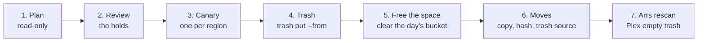

# 31 — Common issues and fixes

**Status: operations reference. Started 2026-09-21 (PVOS D168). Each entry
is what it looks like, why it happens, and the fix — with this fleet (the
NAS, mediabox, feederbox; doc 29) as the worked example. Add an entry
whenever a fix is found, not only when it recurs.**

| Issue | Jump |
|---|---|
| The same episode or movie on two boxes (duplicates) | [§1](#1-duplicates-across-boxes-keep-the-better-copy-move-as-few-files-as-possible) |
| A show filed inside another show's folder | [§2](#2-a-show-misfiled-inside-another-shows-folder) |
| Two editions of a film in one folder | [§3](#3-two-editions-or-cuts-of-a-film-in-one-folder) |
| A catalogue stops updating while files are copied into a region | [§4](#4-a-catalogue-stops-updating-while-files-are-copied-into-its-region) |
| Sonarr upgrades take minutes, and the old file lands in `Recycle` | [§5](#5-sonarr-upgrades-take-minutes-the-recycle-bin) |
| sabnzbd or qBittorrent stall after a roll | [§6](#6-download-clients-stall-after-a-roll) |
| A season's files numbered in another order than Sonarr's | [§7](#7-a-seasons-files-numbered-in-another-order-than-sonarrs) |
| A show Sonarr numbers by segment (whole broadcasts beside segment files) | [§8](#8-a-show-sonarr-numbers-by-segment) |

## 1. Duplicates across boxes: keep the better copy, move as few files as possible

**What it looks like.** `pvfs view conflicts` lists paths, and the forest
page's `conflicts` count is high (790 on 2026-09-21). Plex shows two versions
of an episode; a box's disks fill with bytes the library holds twice.

**Why.** The likely cause: before the view (D164), Sonarr and Radarr could
not see mediabox's disks, so shows living there looked missing and were
downloaded again to the NAS.

**The rule** (Chris, 2026-09-21): keep the better copy; move as few files as
possible. mediabox's copy at least as good → it stays and the NAS copy goes;
a NAS copy clearly better → it replaces mediabox's (moved onto that disk, at
its own path, so no app sees a path change); duplicates within one box → the
best stays put. "Better" = a copy under 90 % of the longest is incomplete,
then resolution, then bitrate (HEVC/AV1/VP9 × 1.5), then audio channels;
"clearly" at the same resolution = ≥ 10 % more bitrate. A disk floor (500 GB
free on mediabox's `/mnt/local2`) drops the smallest upgrades first.



The steps, with the fleet's scripts (PVOS
`deploy/ansible/fleet/dup-cleanup/`, run from a directory on mediabox):

1. **Plan, read-only** — `dup_plan.py`, on a box whose catalogue replica has
   every region's rows (mediabox). It groups video files ≥ 50 MB by show
   folder + episode number (movies by folder), `ffprobe`s every copy of a
   group whose copies differ (cached in `probes.jsonl`), and writes
   `plan.tsv` (one row per copy: quality, action, why) and `actions.tsv`
   (region, path, hash, size — what the next steps do). It prints each disk's
   free space after, against its floor. Nothing moves.
2. **Review before anything moves.** The key is a folder name and a number,
   and it is wrong more often than it looks. The plan **holds** (leaves
   untouched, `action = held`) any group whose copies differ in length —
   movies by more than 3 %, episodes by more than 10 %, a `sample` file
   aside — or whose file names disagree on both show and episode title.
   On 2026-09-21 that caught 49 groups, among them:
   - another show's episodes misfiled in a show's folder under the same
     numbers (§2) — the plan would have trashed the real ones as "incomplete";
   - 7-minute segments against 21-minute broadcasts under one number
     (Animaniacs);
   - a two-part film, and two cuts of one film (§3), in one folder;
   - two different episodes under one number (differing orderings).
   Read `plan.tsv`'s held rows and decide them by hand.
3. **Canary** — one trash per region (`head` a line per region into a list),
   then check each file is gone from its disk, in its box's trash with its
   sidecar, and its group's kept copy in place.
4. **Trash** — `pvfs trash put --from <list>` (lines `region<TAB>path<TAB>hash`,
   full ids; doc 26 §7.3). It moves ONE region's copy, only while it is still
   the file with that hash, on whichever box holds it; each line answers
   `trashed` / `already gone` / `refused …` and the list goes on. **Never
   delete through the view for this**: a delete through the view trashes every
   copy at that path, and in a same-path conflict that includes the one being
   kept. `phase1.sh` does steps 3–4's list from `actions.tsv` and keeps
   `actions-phase1.tsv` — the snapshot every later step reads. Do not re-plan
   after trashing starts: a group with its lesser copy gone no longer says
   which copy was to move.
5. **Free the space** — a trashed file stays on its disk for the region's
   retention (7 days). When the moves need that space sooner, clear that
   day's bucket by hand on the box that holds it: first list what else is in
   it (the arrs' own deletes land there too), then
   `rm -rf <region root>/.pvfs-trash/<day>`. (Permanent; the operator's call.)
6. **Moves** — `phase2_move.py copy` then `phase2_loop.sh` (verify + trash
   every 5 minutes), for each move:
   1. copy the source with `rclone copyto` to the destination filesystem but
      **outside the region's root** (§4) — `/mnt/local/.pvfs-d168-incoming/`
      for `/mnt/local/Media`; where the region IS the filesystem
      (`/mnt/local2`), one file at a time with a pause after each;
   2. rename it into place at its own path — never over a file that is there;
   3. wait for the destination's own catalogue to hash it (no sidecar is
      copied, so the bytes are read and checked end to end);
   4. only when that hash equals the source's does the source go to its
      trash (`pvfs trash put`). A mismatch leaves both and is reported.
7. **Afterwards** — have Sonarr and Radarr rescan the shows and movies
   touched (`arr-rescan.sh`, folder names on stdin), so a tracked file that
   went is re-mapped to the copy that stayed; Sonarr also trashes the old
   copies' subtitles, through the view. In Plex, **Empty Trash** clears the
   versions that now show unavailable ("Empty trash automatically" stays off).

**Worked example (PVOS D168, 2026-09-21).** 1,582 groups in 37 shows and
movies; 49 held (then decided one by one: §2, §3, §7, §8); 1,533 copies
trashed (NAS 733, NAS-ext 3, mediabox 797; the main list in 76 s); 428 files
(1.3 TB) moved NAS → mediabox at the gigabit's ~110 MB/s, 10:47 AM–3:30 PM EDT,
every one verified by mediabox's hash before its NAS original went. The milestone doc: PVOS
`docs/milestones/D168-duplicates.md`.

## 2. A show misfiled inside another show's folder

**What it looks like.** A duplicate plan holds a whole run of a show's
episodes against episodes of *another* show with the same numbers (§1 step
2); on disk, a show's folder sits inside another's —
`TV/Your Lie in April (2014)/Animal Kingdom (2016)/Season 01/…` on
mediabox's `/mnt/local2`, 75 files.

**Fix.** Merge it into the show's own folder, keeping the better copy of
each episode (§1's measure): identical bytes or a better copy where the
show lives → the misfiled copy to its trash; the misfiled copy better → it
moves to the show's folder, replacing the lesser copy there. Where the show's
home is another box, the move is §1 step 6 in reverse (upload to a staging
folder outside that region's root, trash the lesser copy there, rename into
place, check the hash, then trash the misfiled copy). The fleet's script:
`dup-cleanup/merge_misfiled_show.py` (`plan`, `trash`, `move`, `verify`).
Then rescan both series in Sonarr, and remove the emptied folders through the
view (`rmdir`).

Animal Kingdom, 2026-09-21: season 2 byte-identical, season 1 far better on
the NAS (16 against 3 Mb/s) — 35 misfiled copies trashed; seasons 4–6 far
better in the misfiled copy (1080p 10 Mb/s against 720p or 3–4 Mb/s) and
seven season 3 episodes ≥ 10 % better — 40 moved to the NAS (125 GB).

## 3. Two editions or cuts of a film in one folder

**What it looks like.** Two files of different lengths in one movie folder
(`Superbad (2007).mkv`, 114 min; `Superbad (2007)-Copy(1).mkv`, 119 min).
Radarr tracks one; Plex shows two versions with nothing to tell them apart.

**Fix.** Find each file's edition — its length, and the release name often
left in its title tag (`ffprobe -show_entries format_tags=title`: here
`Superbad.2007.UNRATED.EXTENDED…`) — and rename both with Plex's edition
tag, `Title (Year) {edition-Name}.ext`, subtitles with them:

```
cd "/mnt/pvfs/Media/Movies/Superbad (2007)"      # through the view (feederbox)
mv "Superbad (2007)-Copy(1).mkv" "Superbad (2007) {edition-Unrated Extended}.mkv"
mv "Superbad (2007).mkv"         "Superbad (2007) {edition-Theatrical}.mkv"
mv "Superbad (2007).en.srt"      "Superbad (2007) {edition-Theatrical}.en.srt"
```

A rename through the view is done by the box that holds the file, sidecar
and catalogue rows with it (D170). Then rescan the movie in Radarr: it tracks
one edition and leaves the other alone. Radarr's movie format carries
`{edition-{Edition Tags}}` (added 2026-09-21: `{Movie Title} ({Release Year})
{edition-{Edition Tags}}`), so its "Rename" keeps the tags and new imports get
them; without it, a rename would strip them.

## 4. A catalogue stops updating while files are copied into its region

**What it looks like.** Files renamed into a region do not appear in its
catalogue (`pvfs region entries`, the view) for as long as a copy is running
— up to an hour.

**Why.** The watch is recursive inotify over the region's root and starts a
pass after 2 s with no events; its fallback is an hourly reconcile. Every
write to a file anywhere under the root is an event — including a `.pvfs-*`
folder the catalogue walk ignores — so a long copy keeps resetting the
2 seconds and no pass starts. (Found in D168: 46 files placed, none hashed,
until the copies stopped.)

**Fix.** Stage copies on the same filesystem but outside the region's root,
then rename them in; where the region is the whole filesystem, copy one file
at a time with a few seconds' quiet after each. A PVFS fix (a ceiling on the
debounce, or ignoring events under `.pvfs-` names) is tracked separately;
`receive` stages its partials inside the library root the same way.

## 5. Sonarr upgrades take minutes: the recycle bin

**What it looks like.** An upgrade import sits at "importing" for 8–10
minutes; the old file appears in `/mnt/local/downloads/Recycle/`.

**Why.** Sonarr "moves" the file it replaces into its recycle bin; with the
bin on feederbox's local disk and the old file on the NAS, that move is a
full copy over the internet link (~6 MB/s) before the new file is placed.

**Fix.** Turn the recycle bin off (Settings → Media Management, empty path;
done 2026-09-18). A delete through the view already goes to the holder's PVFS
trash for 7 days, restorable with `pvfs trash restore`. Sonarr then logs
"deleting permanently" — through the view it is not.

## 6. Download clients stall after a roll

**What it looks like.** sabnzbd pauses with jobs "missing" or loops on
"Resetting bad trylist"; qBittorrent, writing through the same union, is
exposed the same way.

**Why.** Each roll of feederbox takes its union (`/mnt/unionfs`) away for
~45 s. A download client writing through the union loses its files mid-write.

**Fix.** Point the clients at `/mnt/local` directly — their folders never
leave feederbox — and give Sonarr and Radarr a remote path mapping back to
the union path (host `sabnzbd`, `/mnt/local/downloads/nzbs/sabnzbd/complete/`
→ `/mnt/unionfs/downloads/nzbs/sabnzbd/complete/`), so a usenet import stays a
rename (done 2026-09-18; torrents import by copy anyway, to keep seeding).

## 7. A season's files numbered in another order than Sonarr's

**What it looks like.** Two different episodes under one number (a
duplicate plan holds them: the names disagree on the title), or Sonarr shows
an episode with a file whose title is another episode's. Sam & Max season 1
on mediabox (2026-09-21): all 24 files carried an older order — the file
`s01e14 - It's Dangly Deever Time` is Sonarr's s01e13, and Sonarr, which
maps by the number in the name, had 16 of them on the wrong episodes.

**Fix.** Match every file to Sonarr's episode list **by title** (`GET
/api/v3/episode?seriesId=…`), rename the ones whose number differs through
the view, then rescan the series. Where the renames form a cycle (5 → 7 → 8
→ 6 → 5), rename everything to a temporary name first, then to its final
name — never onto a name still in use. Do the renames in Python (or quote
carefully): **in bash, `&` in a `${var/pattern/replacement}` replacement
means "the matched text"**, and a show named "Sam & Max" came out mangled
(nothing lost; renamed again). A real duplicate left afterwards (two copies of
one title) is §1's rule; between two SD encodes of equal length, a modern
HEVC file beats an old MPEG-4 one even at a lower bitrate — §1's ×1.5 undersells it.

## 8. A show Sonarr numbers by segment

**What it looks like.** Short files (3–10 min) and ~21-minute files under
the same episode numbers — Animaniacs, which Sonarr numbers by segment (160
"episodes" in season 1): the long files are whole broadcasts named after one
of their segments.

**Fix.** Segments that aired together share an air date in Sonarr's list.
For each long file, find its broadcast's other segments and whether each has
its own file (a segment-length file, or a multi-episode one like
`s01e90-e91`): if every segment is covered, the broadcast is a duplicate —
trash it; where an HD broadcast stands against a low-resolution segment file,
keep the HD one (better quality) and trash the segment file; two copies of one
broadcast — keep the better. On 2026-09-21: 32 groups, all duplicates by that
test — 29 SD `.avi` broadcasts and 3 480p segment files trashed (6 GB).
Probe every file first: only groups that differed had been probed, and a
segment "with no file" was really one with a file nobody had measured.

