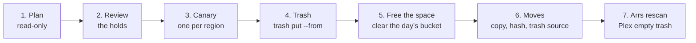

# 31 — Common issues and fixes

**Status: operations reference. Started 2026-09-21 (PVOS D168). Each entry
is what it looks like, why it happens, and the fix — with this fleet (the
NAS, mediabox, feederbox; doc 29) as the worked example. Add an entry
whenever a fix is found, not only when it recurs.**

| Issue | Jump |
|---|---|
| The same episode or movie on two boxes (duplicates) | [§1](#1-duplicates-across-boxes-keep-the-better-copy-move-as-few-files-as-possible) |
| A show filed inside another show's folder | [§2](#2-a-show-misfiled-inside-another-shows-folder) |
| Two editions of a film in one folder | [§3](#3-two-editions-or-cuts-of-a-film-in-one-folder) |
| A catalogue stops updating while files are copied into a region | [§4](#4-a-catalogue-stops-updating-while-files-are-copied-into-its-region) |
| Sonarr upgrades take minutes, and the old file lands in `Recycle` | [§5](#5-sonarr-upgrades-take-minutes-the-recycle-bin) |
| sabnzbd or qBittorrent stall after a roll | [§6](#6-download-clients-stall-after-a-roll) |
| A season's files numbered in another order than Sonarr's | [§7](#7-a-seasons-files-numbered-in-another-order-than-sonarrs) |
| A show Sonarr numbers by segment (whole broadcasts beside segment files) | [§8](#8-a-show-sonarr-numbers-by-segment) |
| A job on the NAS fails for two minutes: "SQLite is busy/locked" | [§9](#9-a-job-fails-for-two-minutes-sqlite-is-busylocked) |
| After a promotion, a box still points at the old owner | [§10](#10-after-a-promotion-a-box-still-points-at-the-old-owner) |
| When did a line in the NAS's `pvfsd.log` happen? | [§11](#11-dating-a-line-in-the-nass-pvfsdlog) |
| `watch pass failed: I/O error during routed write: …` | [§12](#12-a-routed-write-fails-io-error-during-routed-write) |
| `the catalogue job reports an error: refused a region claim from …` | [§13](#13-a-box-refuses-a-region-claim) |
| `pvfs region quality` lists a file as unreadable or suspect; a probe of the NAS's files is skipped | [§14](#14-video-quality-an-unreadable-file-and-the-nass-files) |
| Subtitles and `.nfo` files on a different disk from their media | [§15](#15-subtitles-and-nfo-files-on-a-different-disk-from-their-media) |
| `resolve` reports `copy to trash: No such file or directory` | [§16](#16-resolve-fails-copy-to-trash-no-such-file-or-directory) |
| `rm` of a file just created through the view: `Input/output error` | [§17](#17-rm-of-a-file-just-created-through-the-view-inputoutput-error) |

## 1. Duplicates across boxes: keep the better copy, move as few files as possible

**What it looks like.** `pvfs view conflicts` lists paths, and the forest
page's `conflicts` count is high (790 on 2026-09-21). Plex shows two versions
of an episode; a box's disks fill with bytes the library holds twice.

**Why.** The likely cause: before the view (D164), Sonarr and Radarr could
not see mediabox's disks, so shows living there looked missing and were
downloaded again to the NAS.

**The rule** (Chris, 2026-09-21): keep the better copy; move as few files as
possible. mediabox's copy at least as good → it stays and the NAS copy goes;
a NAS copy clearly better → it replaces mediabox's (moved onto that disk, at
its own path, so no app sees a path change); duplicates within one box → the
best stays put. "Better" = a copy under 90 % of the longest is incomplete,
then resolution, then bitrate (HEVC/AV1/VP9 × 1.5), then audio channels;
"clearly" at the same resolution = ≥ 10 % more bitrate. A disk floor (500 GB
free on mediabox's `/mnt/local2`) drops the smallest upgrades first.


```mermaid
flowchart LR
  P[1. Plan<br/>read-only] --> R[2. Review<br/>the holds]
  R --> C[3. Canary<br/>one per region]
  C --> T[4. Trash<br/>trash put --from]
  T --> S[5. Free the space<br/>clear the day's bucket]
  S --> M[6. Moves<br/>copy, hash, trash source]
  M --> A[7. Arrs rescan<br/>Plex empty trash]
```

The steps, with the fleet's scripts (PVOS
`deploy/ansible/fleet/dup-cleanup/`, run from a directory on mediabox):

1. **Plan, read-only** — `dup_plan.py`, on a box whose catalogue replica has
   every region's rows (mediabox). It groups video files ≥ 50 MB by show
   folder + episode number (movies by folder), `ffprobe`s every copy of a
   group whose copies differ (cached in `probes.jsonl`), and writes
   `plan.tsv` (one row per copy: quality, action, why) and `actions.tsv`
   (region, path, hash, size — what the next steps do). It prints each disk's
   free space after, against its floor. Nothing moves.
2. **Review before anything moves.** The key is a folder name and a number,
   and it is wrong more often than it looks. The plan **holds** (leaves
   untouched, `action = held`) any group whose copies differ in length —
   movies by more than 3 %, episodes by more than 10 %, a `sample` file
   aside — or whose file names disagree on both show and episode title.
   On 2026-09-21 that caught 49 groups, among them:
   - another show's episodes misfiled in a show's folder under the same
     numbers (§2) — the plan would have trashed the real ones as "incomplete";
   - 7-minute segments against 21-minute broadcasts under one number
     (Animaniacs);
   - a two-part film, and two cuts of one film (§3), in one folder;
   - two different episodes under one number (differing orderings).
   Read `plan.tsv`'s held rows and decide them by hand.
3. **Canary** — one trash per region (`head` a line per region into a list),
   then check each file is gone from its disk, in its box's trash with its
   sidecar, and its group's kept copy in place.
4. **Trash** — `pvfs trash put --from <list>` (lines `region<TAB>path<TAB>hash`,
   full ids; doc 26 §7.3). It moves ONE region's copy, only while it is still
   the file with that hash, on whichever box holds it; each line answers
   `trashed` / `already gone` / `refused …` and the list goes on. **Never
   delete through the view for this**: a delete through the view trashes every
   copy at that path, and in a same-path conflict that includes the one being
   kept. `phase1.sh` does steps 3–4's list from `actions.tsv` and keeps
   `actions-phase1.tsv` — the snapshot every later step reads. Do not re-plan
   after trashing starts: a group with its lesser copy gone no longer says
   which copy was to move.
5. **Free the space** — a trashed file stays on its disk for the region's
   retention (7 days). When the moves need that space sooner, clear that
   day's bucket by hand on the box that holds it: first list what else is in
   it (the arrs' own deletes land there too), then
   `rm -rf <region root>/.pvfs-trash/<day>`. (Permanent; the operator's call.)
6. **Moves** — `phase2_move.py copy` then `phase2_loop.sh` (verify + trash
   every 5 minutes), for each move:
   1. copy the source with `rclone copyto` to the destination filesystem but
      **outside the region's root** (§4) — `/mnt/local/.pvfs-d168-incoming/`
      for `/mnt/local/Media`; where the region IS the filesystem
      (`/mnt/local2`), one file at a time with a pause after each;
   2. rename it into place at its own path — never over a file that is there;
   3. wait for the destination's own catalogue to hash it (no sidecar is
      copied, so the bytes are read and checked end to end);
   4. only when that hash equals the source's does the source go to its
      trash (`pvfs trash put`). A mismatch leaves both and is reported.
7. **Afterwards** — have Sonarr and Radarr rescan the shows and movies
   touched (`arr-rescan.sh`, folder names on stdin), so a tracked file that
   went is re-mapped to the copy that stayed; Sonarr also trashes the old
   copies' subtitles, through the view. In Plex, **Empty Trash** clears the
   versions that now show unavailable ("Empty trash automatically" stays off).

**Worked example (PVOS D168, 2026-09-21).** 1,582 groups in 37 shows and
movies; 49 held (then decided one by one: §2, §3, §7, §8); 1,533 copies
trashed (NAS 733, NAS-ext 3, mediabox 797; the main list in 76 s); 428 files
(1.3 TB) moved NAS → mediabox at the gigabit's ~110 MB/s, 10:47 AM–3:30 PM EDT,
every one verified by mediabox's hash before its NAS original went. The milestone doc: PVOS
`docs/milestones/D168-duplicates.md`.

## 2. A show misfiled inside another show's folder

**What it looks like.** A duplicate plan holds a whole run of a show's
episodes against episodes of *another* show with the same numbers (§1 step
2); on disk, a show's folder sits inside another's —
`TV/Your Lie in April (2014)/Animal Kingdom (2016)/Season 01/…` on
mediabox's `/mnt/local2`, 75 files.

**Fix.** Merge it into the show's own folder, keeping the better copy of
each episode (§1's measure): identical bytes or a better copy where the
show lives → the misfiled copy to its trash; the misfiled copy better → it
moves to the show's folder, replacing the lesser copy there. Where the show's
home is another box, the move is §1 step 6 in reverse (upload to a staging
folder outside that region's root, trash the lesser copy there, rename into
place, check the hash, then trash the misfiled copy). The fleet's script:
`dup-cleanup/merge_misfiled_show.py` (`plan`, `trash`, `move`, `verify`).
Then rescan both series in Sonarr, and remove the emptied folders through the
view (`rmdir`).

Animal Kingdom, 2026-09-21: season 2 byte-identical, season 1 far better on
the NAS (16 against 3 Mb/s) — 35 misfiled copies trashed; seasons 4–6 far
better in the misfiled copy (1080p 10 Mb/s against 720p or 3–4 Mb/s) and
seven season 3 episodes ≥ 10 % better — 40 moved to the NAS (125 GB).

## 3. Two editions or cuts of a film in one folder

**What it looks like.** Two files of different lengths in one movie folder
(`Superbad (2007).mkv`, 114 min; `Superbad (2007)-Copy(1).mkv`, 119 min).
Radarr tracks one; Plex shows two versions with nothing to tell them apart.

**Fix.** Find each file's edition — its length, and the release name often
left in its title tag (`ffprobe -show_entries format_tags=title`: here
`Superbad.2007.UNRATED.EXTENDED…`) — and rename both with Plex's edition
tag, `Title (Year) {edition-Name}.ext`, subtitles with them:

```
cd "/mnt/pvfs/Media/Movies/Superbad (2007)"      # through the view (feederbox)
mv "Superbad (2007)-Copy(1).mkv" "Superbad (2007) {edition-Unrated Extended}.mkv"
mv "Superbad (2007).mkv"         "Superbad (2007) {edition-Theatrical}.mkv"
mv "Superbad (2007).en.srt"      "Superbad (2007) {edition-Theatrical}.en.srt"
```

A rename through the view is done by the box that holds the file, sidecar
and catalogue rows with it (D170). Then rescan the movie in Radarr: it tracks
one edition and leaves the other alone. Radarr's movie format carries
`{edition-{Edition Tags}}` (added 2026-09-21: `{Movie Title} ({Release Year})
{edition-{Edition Tags}}`), so its "Rename" keeps the tags and new imports get
them; without it, a rename would strip them.

## 4. A catalogue stops updating while files are copied into its region

**What it looks like.** Files renamed into a region do not appear in its
catalogue (`pvfs region entries`, the view) for as long as a copy is running
— up to an hour.

**Why (before PVOS D180).** The watch is recursive inotify over the region's
root and starts a pass after 2 s with no events; its fallback is an hourly
reconcile. Every write to a file anywhere under the root was an event —
including a `.pvfs-*` folder the catalogue walk ignores — so a long copy kept
resetting the 2 seconds and no pass started. (Found in D168: 46 files
placed, none hashed, until the copies stopped.)

**Fix — built.** PVOS D180 (PVFS `v1.4-402`, on the fleet since the
v1.4-420 roll of 2026-09-22) does both: the watch ignores events on what its
walk passes over (`.pvfs-*` names such as `receive`'s partials and the
trash, sidecars, litter), and a pass starts at most 30 s after the first
change however many keep coming (`pvfs serve watch --ceiling-ms`). A copy
into a region now delays its catalogue by half a minute, not the hour.
Staging outside the root and renaming in is still the tidy way on an older
build, and it keeps half-copied files out of a pass.

## 5. Sonarr upgrades take minutes: the recycle bin

**What it looks like.** An upgrade import sits at "importing" for 8–10
minutes; the old file appears in `/mnt/local/downloads/Recycle/`.

**Why.** Sonarr "moves" the file it replaces into its recycle bin; with the
bin on feederbox's local disk and the old file on the NAS, that move is a
full copy over the internet link (~6 MB/s) before the new file is placed.

**Fix.** Turn the recycle bin off (Settings → Media Management, empty path;
done 2026-09-18). A delete through the view already goes to the holder's PVFS
trash for 7 days, restorable with `pvfs trash restore`. Sonarr then logs
"deleting permanently" — through the view it is not.

## 6. Download clients stall after a roll

**What it looks like.** sabnzbd pauses with jobs "missing" or loops on
"Resetting bad trylist"; qBittorrent, writing through the same union, is
exposed the same way.

**Why.** Each roll of feederbox takes its union (`/mnt/unionfs`) away for
~45 s. A download client writing through the union loses its files mid-write.

**Fix.** Point the clients at `/mnt/local` directly — their folders never
leave feederbox — and give Sonarr and Radarr a remote path mapping back to
the union path (host `sabnzbd`, `/mnt/local/downloads/nzbs/sabnzbd/complete/`
→ `/mnt/unionfs/downloads/nzbs/sabnzbd/complete/`), so a usenet import stays a
rename (done 2026-09-18; torrents import by copy anyway, to keep seeding).

## 7. A season's files numbered in another order than Sonarr's

**What it looks like.** Two different episodes under one number (a
duplicate plan holds them: the names disagree on the title), or Sonarr shows
an episode with a file whose title is another episode's. Sam & Max season 1
on mediabox (2026-09-21): all 24 files carried an older order — the file
`s01e14 - It's Dangly Deever Time` is Sonarr's s01e13, and Sonarr, which
maps by the number in the name, had 16 of them on the wrong episodes.

**Fix.** Match every file to Sonarr's episode list **by title** (`GET
/api/v3/episode?seriesId=…`), rename the ones whose number differs through
the view, then rescan the series. Where the renames form a cycle (5 → 7 → 8
→ 6 → 5), rename everything to a temporary name first, then to its final
name — never onto a name still in use. Do the renames in Python (or quote
carefully): **in bash, `&` in a `${var/pattern/replacement}` replacement
means "the matched text"**, and a show named "Sam & Max" came out mangled
(nothing lost; renamed again). A real duplicate left afterwards (two copies of
one title) is §1's rule; between two SD encodes of equal length, a modern
HEVC file beats an old MPEG-4 one even at a lower bitrate — §1's ×1.5 undersells it.

## 8. A show Sonarr numbers by segment

**What it looks like.** Short files (3–10 min) and ~21-minute files under
the same episode numbers — Animaniacs, which Sonarr numbers by segment (160
"episodes" in season 1): the long files are whole broadcasts named after one
of their segments.

**Fix.** Segments that aired together share an air date in Sonarr's list.
For each long file, find its broadcast's other segments and whether each has
its own file (a segment-length file, or a multi-episode one like
`s01e90-e91`): if every segment is covered, the broadcast is a duplicate —
trash it; where an HD broadcast stands against a low-resolution segment file,
keep the HD one (better quality) and trash the segment file; two copies of one
broadcast — keep the better. On 2026-09-21: 32 groups, all duplicates by that
test — 29 SD `.avi` broadcasts and 3 480p segment files trashed (6 GB).
Probe every file first: only groups that differed had been probed, and a
segment "with no file" was really one with a file nobody had measured.


## 9. A job fails for two minutes: "SQLite is busy/locked"

**What it looks like.** The forest page goes `warning` for a minute or two
with *"the NAS: watch — SQLite is busy/locked during upsert region entry
(retried 0x)"* — or the same for the NAS's follow (`begin replica
ingest`), receive or `insert snapshot` — then clears by itself. About once a
day in the week to 2026-09-26 (PVOS D194). The box's `pvfsd.log` shows
`watch pass failed: … ; retrying`, a `catalogue <region> at head N: M rows`
line beside it, and `watch recovered: a pass completed after 1 failed
pass(es) over 2 min`.

**Why.** Each box keeps a copy of every other box's catalogue, and its
`catalogue` job (every 60 s) installs a region's new head when the region's
box publishes one. Until D194 the install deleted every row of the region
and inserted the manifest's, in one transaction: ≈59,000 row writes for
mediabox's `mediabox-local` (≈29,500 rows) when two files had changed. The
daemon's other jobs wait 15 s for the write lock (D141); on the NAS the
install took longer, so the job that wrote next lost its pass. 20 of the 23
busy failures in the NAS's log (2026-09-17 → 26) sit beside such an
install. "Retried 0x" is accurate: the statement did not retry; the pass
did, two minutes later.

**Fix.** PVFS with D194: an install writes only the rows that differ, so a
two-row head bump holds the lock for milliseconds (measured on presubuntu's
disk: 1.4 s → 28–68 ms for 30,000 rows). The daemon then logs `catalogue …
M rows (+a changed c removed r)`. Nothing to do on a box before that — each
failure heals at the next pass; check the box's build (`pvfs --version`)
before chasing one. A busy failure with no `catalogue` line beside it, or a
`routed scan write` one (the owner's database, not the box's), is something
else.

**The whole class, since D199.** Every job used to open its own engine — a
second, third, fourth connection to one database in one process — so any
long write on one made the others fail after 15 s, and each open folded the
log under a lock the daemon's own threads then waited on (`pvfs: waiting
for another pvfs process folding this forest…`: 31 times in a day on the NAS
before D199, the "other process" being the daemon itself). With D199 a
daemon writes through ONE connection, taking it one short step at a time,
and a served write waits for one step at most. After it, a busy/locked
failure on a daemon's own jobs, or a fold-lock wait, means another process
— a CLI command, a view mount — holds the database. Any hold of the writer
over a second is logged with who held it (`pvfsd: the writer was held …
by …`), and the hourly `pvfsd: the writer, last hour: …` line gives the
longest hold and whose. Two settings keep the holds short on a slow disk:
the daemon checkpoints the WAL on a thread of its own (`a checkpoint took …
(off the writer)` when one is slow), and its writer commits derived state
— `index.db`, and on a replica its copy of the owner's log — without an
fsync each; an OS crash can cost those last commits, which the next start,
pass or fetch puts back.

## 10. After a promotion, a box still points at the old owner

**What it looks like.** After another box was promoted to owner (PVFS doc
28), one box keeps its old source. Its `follow` reports *"the source (…) is
behind this replica …"* — a `job_error` on the phone — and its watch logs
`no route through the owner (… the owner is fenced (…)) — cataloguing here`.
The old owner fenced itself the first time a box ahead of it wrote (PVOS
D182), and its `serve status` says `fenced`.

**Why it is not worse.** Since PVOS D196 a replica treats a fenced owner as
no route, as it treats an unreachable one (D183): a box whose bindings are
all catalogue regions keeps cataloguing its disk and publishes its heads
locally, pending, and its peers take them as provisional heads. Before D196
every watch pass failed against the refusal, backing off to five minutes, and
the box stopped cataloguing. Its follower now retries in backoff (2 s
doubling to 30 s), not every 2 s.

**Fix.** Re-point the box at the new owner, as the promotion does for every
box it knows (doc 28 §4): `pvfs instance add <alias>-src <new-owner>:<port>
<pin>`, `pvfs replica repoint <mount> --instance <alias>-src`, restart its
daemon. The next pass routes through the new owner and the pending heads
commit.

## 11. Dating a line in the NAS's `pvfsd.log`

**What it looks like.** The NAS (QTS, no systemd, so no journal) keeps its
daemon's output in `<nas_home>/pvfsd.log`. Lines from before PVOS D200's
roll carry no date: D173 dated them by the owner's journal, D174 and D194 by
the catalogue head numbers they name.

**Fix.** Since PVOS D200 the NAS play's start script (`bin/start-pvfs.sh`)
runs the daemon through BusyBox `awk`, which puts the NAS's local time and
offset in front of every line: `2026-09-30 18:11:08 -0400 pvfsd: …`. Nothing
to do but roll the NAS; the first dated line is the daemon's start in the
roll's down window. Undated lines after that date mean `awk` was killed and
`cat` took over the pipe (by design: the daemon's stderr never breaks); the
next start of the daemon dates them again. `watchdog.log` beside it was
always dated, by the same clock.

## 12. A routed write fails: "I/O error during routed write"

**What it looks like.** A replica's watch logs `watch pass failed: I/O error
during routed write: …` — for example `Resource temporarily unavailable (os
error 11)` (this box's own 180 s idle timeout on the connection to the
owner), `failed to fill whole buffer` (the owner went away inside an
answer), or `internal: … database or disk is full` (the owner's own
trouble) — then `watch recovered …` once the owner answers again.

**Why.** A write a replica routes through the owner (its catalogue head; on
an old-model binding, each file's node) is judged by the failure's type
since PVOS D200, never by words in its message: the owner's `busy` is
waited out on the same connection (six tries, D141); a failed connection,
or trouble of the owner's own (`internal`), fails the pass, and the next
pass dials again (5 s, backing off); only a refusal of the write itself
(`bad_input`, `forbidden` — a fenced owner's included — `not_found`, …) is
permanent. Before D200 the classifier looked for eleven words (busy,
timeout, connection, …); a network failure without one came back as a
refusal, and on an old-model binding every remaining file of the pass was
quarantined while the dead connection was kept.

**Fix.** Nothing, if it recovers: that is the design. If it does not, the
owner is the place to look — its daemon, its disk, its database — not this
box. An owner that has just started answers `busy` until it has heard its
followers (D185): that is waited out, and only a hold longer than the six
tries fails one pass (`SQLite is busy/locked during routed scan write
(retried 6x)` — the owner's word was `busy`, not always SQLite's).

## 13. A box refuses a region claim

**What it looks like.** On the phone (since PVOS D206): *"On feederbox, the
catalogue job reports an error: refused a region claim from
192.168.1.142:7433: a1b2c3d4: its author may not publish this region (…)"*,
and the same line under that box on the page. Its journal says, every
minute, `pvfs: catalogue: a claim from <addr> for <region> refused: <why>`.

**Why.** Each box's catalogue job asks the others for the region heads they
signed (PVOS D183) and takes those the fold's rule accepts, so a region's
new files reach every box even while the owner is down. A claim is refused
when its signature does not verify, its author has no grant to publish the
region, it is not a catalogue region, or it offers another hash at a seq the
forest log (or an earlier claim) already holds. The pass itself completes;
the refusal is a note on its row, said once it has stood about four minutes
and cleared when it stops.

**Fix.** By the reason:

- *another hash at seq N, which the forest log already holds* / *two
  different heads at seq N*: the claiming box published a head the owner
  settled otherwise. Usually it clears by itself when that box's next head
  commits. If it stands, look at the claiming box's `pvfs region ls` (a
  head `pending the owner`) and the owner's.
- *its author may not publish this region* / *its signature does not
  verify*: the claiming box signs with a key that has no admin grant on the
  region (a re-seeded box, a replaced key). Check the region's grants on the
  owner (`pvfs acl ls <region>`) against the claiming box's key.
- A refusal on the owner itself shows on the page only: the owner does not
  poll itself.


## 14. Video quality: an unreadable file, and the NAS's files

**Symptom.** `pvfs region quality` lists a file as *unreadable* or
*suspect*; or the journal of the box that measures for the NAS (mediabox)
says `pvfsd: probe: region XXXXXXXX skipped: …`.

**What it means** (PVOS D208, D211). A box's watch measures each video file
on its own disk with ffprobe; mediabox measures the NAS's (which has no
ffprobe) through its `probe-remote` file, reading ranges from the NAS over
the LAN. When ffprobe says the data is invalid the file is a *suspect*; a
second probe 30 minutes or more later that says the same makes it
*unreadable*, and from then on it loses to any copy of that path that was
measured (the served copy, the drain). An I/O or permission error is never
"unreadable": nothing is recorded and the file is tried again after six
hours.

**Fix.**

- *unreadable*: play it. If it really is broken, replace it (an arr search);
  the new file is measured afresh. A copy elsewhere that reads is already
  the one served.
- *skipped: its holder … looks remote*: the NAS took over 10 ms to accept a
  connection — a network problem between mediabox and the NAS, or a holder
  that is not on the LAN (the probe never reads across the WAN).
- *skipped: … no holder known*: mediabox has not fetched that region's head
  yet (`pvfs region ls`); it clears with the catalogue job.
- *the holder refused … forbidden*: mediabox's client identity has no `w` on
  the region (`pvfs acl ls <region>` on the owner).
- `probe-remote names N region(s), but this box has no ffprobe`:
  `apt install ffmpeg` on the measuring box (not on the NAS).

## 15. Subtitles and `.nfo` files on a different disk from their media

**What it looks like.** A show's video files are in one region (`library`
on the NAS, or `mediabox-local2`) and its subtitles, `.nfo` files and
artwork in another (`mediabox-local`). Nothing is broken — the view shows
them side by side and Plex plays them — but the files are on different
disks, and each move of the media leaves the others behind. Counted on
2026-10-03: 8,723 such files, 6,805 of them on `mediabox-local` beside
video the NAS's `library` holds (PVOS `docs/milestones/D216-placement-follows-the-folder.md` §1).

**Why.** Two mechanisms. `receive` put every new file in the receiving
region with the most free space, not the one that already held its season.
And a file an app creates through a mergerfs union lands on the union's
writable branch — on mediabox `/mnt/local`, the only one — wherever its
media is: Bazarr's subtitles above all.

**Fix — built for what PVFS places; open for what bypasses it.** PVOS D216
and D217 (PVFS `f78587b`, `59eb640`, `9b314d1`; on the fleet since
`v1.4-549`, 2026-10-04): a file PVFS places — a `receive` pull, or a create
through a view mounted `--writable` — goes to the region that already holds
its folder and has room above its floor, and in a split folder to the one
holding a file with the same stem (user manual §7.13, "Where a new file
goes"). The files already split were moved by the session that built it:
8,705 moved, none failed (its own summary of 2026-10-04; not counted again
since). Still open:

- A file written through the mergerfs union instead of the view lands on
  the union's writable branch as before. About 40 subtitles Bazarr wrote
  during that migration did (the same summary).
- A create through a box's view lands on that box's own disks: a subtitle
  made on mediabox for an episode only the NAS holds stays on mediabox.
- PVFS has no command that finds or moves split files (D216 §5's reconcile
  pass was not built as a command).

## 16. `resolve` fails: "copy to trash: No such file or directory"

**What it looks like.** The ingest box's `resolve` row (`pvfs serve
status`, the forest page) shows an error ending `copy to trash: No such
file or directory`, gone at the next pass. feederbox, 2026-10-03 11:09 AM:
cleared four minutes later, while Sonarr upgraded five episodes of one show.

**Why.** `resolve` checks that a staging copy is a file, then reads its
tail and asks the library's box to confirm the bytes — a network round trip
— before it moves the copy to the trash. The arrs delete and replace files
in staging all day; one that went inside that window aborted the whole
pass and left its remaining candidates for the next. And the move's
copy-then-remove fallback, meant for a trash on another filesystem, ran on
every rename error, so a source that had vanished read as a trash that
could not be written. The trash was never at fault.

**Fix — built** (PVFS `2d804ba`, 2026-10-03; on the fleet since `v1.4-549`,
2026-10-04). A copy that goes mid-pass is nothing to do and the pass
carries on; the fallback runs only across filesystems (`EXDEV`), and any
other failure says `move to trash`. On an older build there is nothing to
do: the next pass, five minutes later, clears it.

## 17. `rm` of a file just created through the view: "Input/output error"

**What it looks like.** On a view mounted `--writable`, a tool writes a
file and removes it straight away, as an arr does, and the `rm` fails with
`Input/output error`. Found on the fleet on 2026-10-04, minutes after the
roll to `v1.4-548`.

**Why.** A delete through the view sends each catalogued copy of the file
to its region's trash. A file created through the mount has no catalogued
copy until the `watch` job has hashed it, so there was nothing to send and
the delete answered `EIO`.

**Fix — built** (PVFS `ea84559`, `v1.4-549`, on the fleet since 2026-10-04
about 1:00 PM). Deleting such a file removes the bytes the create wrote,
outright: no trash, because nothing is catalogued to restore from. **Still
open** (PVOS D218 §2.1): truncating or renaming a file in the same state
answers `Input/output error` too, so a tool that writes a temporary file
and renames it into place fails and leaves the temporary file behind; and
after 10 minutes uncatalogued the file drops out of the mount's listing,
though its bytes are on disk (user manual §7.13, known problems).
